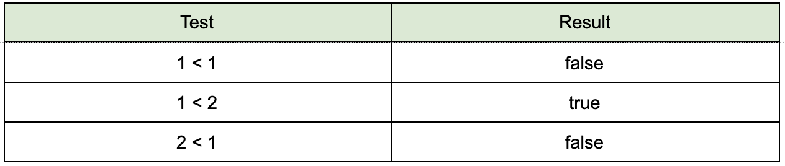
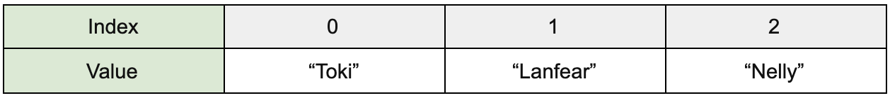

# Beginning Object-Oriented Programming for Grapplers

## Foreward

Hi there. My name is Rob. My best friend,  an ex-military garbage man that spends his weekends crashing dirt bikes, once told me “you are the smartest idiot I’ve ever met”. It’s qualifications like that which make me confident in my ability to write a better beginner’s programming book. Despite being handicapped by being me, I managed to learn how to program in my spare time while working 12-hour shifts at a tire factory. It’s been decades plural since those days and getting into programming has changed my life completely. Maybe my book will help a poor dumb kid who needs a leg up on life the way I did.  
  
I might not have a Harvard degree, but I _did_ get a university degree (and the loans along with it) because back then most jobs wouldn’t even consider hiring you without one. I can say after almost a quarter of a century working in the industry - the degree itself is just expensive paper. You get good at creating software by spending time creating software. You can take classes, read books, do research, memorize facts and theorize until the universe collapses and if you never write code and bang your head against the wall trying to figure out why it doesn’t work you will _never_ have the necessary experiences to mature in the art of creating working software. College, deep down, is for verification to potential future employers that you’ve been provided the necessary information and been tested to ensure you minimally understand it. Neither the providing or verification of information is the important ingredient to being good at programming though, is it?

During my time I’ve read an awful lot of beginner programming books. Most were carefully laid out, highly categorized, highly organized and chock full of details they try to teach you using the sieve of Eratosthenes for some damn reason; like maybe if we introduce math stuff that’ll make it easier? It’s been my longtime belief that more beginners might stick around if the intro books didn’t go into painstaking detail on how many bits each data type has in the first chapter right after “hello world”. It might not be the greatest concern for that  “99 bottles of beer on the wall” app is all I’m saying. 

I’m not worried too much about being organized or making sure I cover every little detail or combining all like stuff together in one place where you can quickly find it with the table of contents or the index. I think that format has its place and makes for great reference which is invaluable but not always the best tool for learning. I want to teach the core objected-oriented programming concepts in a “conversational” manner and damn all the boring fine print until I get motivated enough to write the “intermediate” book at which point you’re already invested. I hope you really dig dad jokes. 


## Chapter 1 - Hello Severed Head

You got this severed head just like me...pretty rad, right? It’s the smartest severed head around. At least it said so on the box. Strangest thing though, it doesn’t have a mouth, or eyes, or ears, or a nose.

Wouldn’t you know it, you just found a flyer for a *smartest severed head* contest. The winner gets free bacon for life. The **thick** kind. 

Have you ever worried that you might not have a good way of proving that your severed head is the best when there's bacon on the line? Then you’ve come to the right place. 

---- 

### Visual Studio

Your first task is to install Visual Studio on your computer. Visual Studio is the app we use to facilitate communication with severed heads for the purpose of teaching them to do things for us, so they can work while we sit and watch cartoons. 

Usually there would be painstakingly detailed instructions in this section detailing how to set up your development environment. In my experience - by the time everything is written and published all of the pictures would look different and the instructions would be wrong because things change over time. It would probably cost you time and confusion. Instead of doing that, I’m going to be lazy and I’m not going to bother writing any of that. Better for you to look to the official website.

To get started do the following:
- Install Visual Studio - https://visualstudio.microsoft.com/
	- **Important** - When it asks you which *workloads* to install ensure that you select “.Net Desktop Development”, or you won’t have the template to create _console applications_. 
- Make a folder on your drive to put all of your projects in.
	- I’d recommend that you name it something flashy like “projects” and maybe put it in your user directory: `mkdir ~/projects`
- Create a _new solution_ (file -\> new solution)
- Make the template a _new console application_
- Create it in the directory you created for your projects
- Name the project/solution hello\_world
- If it asks for a version, the .NET version and Visual Studio versions don’t really matter for the stuff in this book. I’m going to show you things that are fairly universal so you can just pick the version with the biggest first number.
- Once the solution is created, locate the solution explorer and poke around a bit. It basically gives you a listing of all the files in your project and you can click them to look at them in a text editor. 
- Locate a file in the _Solution Explorer_ called _Program.cs_ and open it up in the editor

If you got this far - congratulations. You’ve got what it takes to be a novice severed head trainer and I officially confer upon you this title. Your parents will be so proud. 

---- 

### How to How To

We’re going to start looking at code shortly and I want to give you some advice for getting the most out of it.

*First*, don’t stress out too much about understanding each and every little thing. For the time being just follow along and _type it all in by hand_. 

*Second*, If you don’t understand something, spend just a little time trying to and if you still don’t get it just accept it as magic and move on. It’ll almost certainly be touched on more than once and repeated exposure is slowly going to clear the fog.   

#### How to Practice
When I was a software pup I had to read my basic books several times over before everything made sense. I have read many of these sorts of books over the years and I found a practice pattern for learning stuff like this that seems to work really well for me. Give it a try if you like:

- Read a chapter once straight through and type all of the examples in. Spend a little time on things you don’t understand before moving on but don’t stress if everything doesn’t stick first go. 
- Get the programs working whether or not you understand everything in them. It’ll get all the words and ideas bubbling around in your brain.
 - Keep reading the chapter again but much faster each time. Just lightly skim over the parts you understand. It’s the parts you don’t understand where you need to spend the lion’s share of your time.
- Experiment. Try stuff out. Don’t be a clingy stalker and creep on my book and refuse to do anything else. Try to make your own stuff to learn how to express yourself.
- Do not be afraid to use other sources to help fill in the blanks. Being able to independently research to overcome obstacles is a core skill. 

---- 

### WTF IS A Programming Language

Alright, so let’s stop flapping gums and get to it then. That file I had you open in your editor; *Program.cs*; should look something like this:

```cs
using System;

namespace hello_world
{
	class Program
	{
		static void Main(string[] args)
		{
			Console.WriteLine("Hello World!");
		}
	}
}
```

This text is *code* from the programming language. This language is named C# (pronounced See Sharp). What exactly is a programming language and how is it different from a regular language?

One of the ways that we humans communicate is by using meat. We push air through various configurations of meat in order to produce vibrations known as sounds. These sounds can be associated with concepts. The individuals involved in these communication must agree upon which sounds correspond to which concepts, or they will *not* be able to comprehend one another. We call this process *talking*. 

We further abstract the *talking* process into drawings, or letters, that we use to represent sounds. We smash these letters together to form a map of sounds you’d make if you were talking. By doing this we gained the ability to archive sounds on paper and communicate without the need of vibrating meat. We call this process *writing*.

Unfortunately computers base _very_ little upon the vibrations of meat. Computer communication is more electrical in nature. Less about vibration and more about on and off (or true and false). For computers, everything has to be precisely defined in terms of something else, down to the point you are left with nothing but ones and zeros which can be represented using electricity (on/off). 

As you can imagine, a human might have a *very* difficult time seeing a funny doge meme if you give them millions of ones and zeros they have to translate into color codes; but a computer has no issue at all. A computer can read it near instantly and light up the correct pixels on your monitor to represent it. 

So how do we bridge this communication gap? How do we have a conversation with computers seeing as how we don’t share a natural communication medium that makes sense to the other? Computers can think like an oddly shaped severed head, but they have no meat to talk and no ears to hear. The reverse is also true, I am assuming that you have _very_ few ports. I don’t have that many.  

To explain how we go about solving this issue, have you ever watched those old Star Trek movies where they could talk to aliens who spoke crazy alien languages by using a _translator_? The translator made it so that everyone heard the conversation in their native language. Only the translator itself needed to understand both languages and then everyone could happily talk through it. 

The translator in this story is known as a *compiler* in programming. When you type instructions (code) and build your project what you are essentially doing is running your code through a translator that turns it into something a computer can understand. If the computer needs to talk back to give you error or informational messages the compiler will communicate it back to you. 

The compiler creates a file that your computer can read and follow, called an _executable_, based on the C\\# code you provide.

The process that the compiler goes through to translate your code into executable instructions is called *compiling*.

---- 

### The Main Method

Now that we have some of the external concepts explained, let’s jump back into code. For now we don’t need to focus much on understanding most of the code we’ve seen. When I started out I thought it was very important to understand every single piece of text in the code. Don’t do that because chances are that you are missing some required concepts and we are going to talk about when it makes more sense. For now the only part you need to concern yourself is here:

```cs
static void Main(string[] args)
{
	// CODE GOES HERE
}
```

Programs can be composed of many files, each full of instructions. The computer needs to know where it is supposed to _start_ in this potentially huge pile of instructions. To tell the computer where to start, most object-oriented programming languages have the concept of “_The Main Method_”; at least for console-style applications. Not _A_ Main method. _THE_ Main method. Put some respeck on its name.

---- 

### The Console.WriteLine Method

Back to the severed heads. They can follow instructions very well but they’re not very creative. They only do exactly as you ask. Let’s tell our computer to do something. We’re going to give the computer instructions to send us a greeting message whenever we run the executable created by the compiler. Find your Program.cs file and alter it until it looks like this:

```cs
using System;

class Program
{
	static void Main(string[] args)
	{
		Console.WriteLine("Good day boss!");
	}
}
```

Save that file after you have made the changes. There should be a start button in Visual Studio that you can push to run the application. It’ll look like a play arrow in your application, or alternatively you can look in the menus. Fire it up. 


When you start the application the compiler automatically creates an _executable file_ based on the code in the Program.cs file and then runs it for you. Alternatively, you could run the application yourself by navigating to the folder the compiler placed the executable file in and clicking on it like you do for a desktop shortcut. 

The output should show up in the console (Terminal) when you run the program: 

`Good day boss!`

Holy cow that’s amazing! Every time I hit the run button this program strokes my enormous ego! 

The line of code that is actually doing all the heavy lifting for our program is this one:

```cs
Console.WriteLine("Good day boss!");
```

The Console.WriteLine _method_ (said “Console dot WriteLine) is an instruction that you provide when you want to send the person executing the application a message. 

Instructions with the parenthesis() at the end are called _methods_ for future reference, not instructions. I imagine Method Man got the name programming for Wu Tang. 

Console.WriteLine is much more useful than this initial example might have you believe. You can use it to prompt users for input, to provide information about the internal state of your programs or to help locate errors among many other things. We’re going to be using it a lot.

---- 

### Semi-Colonoscopy

When you place an instruction in your code you must tell the compiler where your instruction ends using a semi-colon character. If you don’t you will get an error message and likely a red-squiggle alerting you that something is wrong in in Visual Studio. 

---- 

### Executive Summary

##### Visual Studio
Visual Studio is the application we use to write programs. It compiles C\\# code into executables. 

Visual Studio has a “Solution Explorer” that you can use to look at all the files in your program and open them up to edit. 

It has a text editor with cool highlighting powers to make the language easier to read. It also tries to give you hints on what code to write.  

##### Programming Language
A programming language is a written language made up of instructions and commands that are human readable. This language is then taken by a compiler and turned into instructions that a machine can execute.  

##### The Compiler
The compiler gathers up all of your instruction files and then compiles them into an executable file that a computer can understand. 

##### The Main Method
The computer needs to know where to start executing. For console applications this is “The Main method”. Instructions inside of *Main* are the ones that are executed, from top to bottom. 

##### Console.WriteLine
Console.WriteLine is a C# method (instruction) you put in your code to tell the computer to output a message to the terminal. 

##### Semi-Colonoscopy
An instruction must end with a semicolon to tell the compiler where it ends. Like punctuation for programs. 

---- 

### TEST YOUR MIGHT
Change the Program.cs file so that instead of saying “Good day boss” it says “Good day BIG boss” and then run it. Respeck. 

---- 


## Chapter 2 - How to Train Your  Severed Head

I was just sitting there minding my own business when to my horror; something started growing out of its face.

What in God’s name is that noise?

**Severed Head**: _brrppllllssshhhpppllllssshhhh_
** Me **: What?
** Severed Head **: _PLOOP SPPLLLLLOOOOOORT_
** Me **: That’s disgusting...
** Severed Head **: GOOD DAY BOSS!
** Me **: um, HI THERE!
** Severed Head **: GOOD DAY BOSS!
** Me **: Yeah...uh...Hi there! That’s twice! Not meaning to be rude or anything but maybe we move on from the greetings?
** Severed Head **: GOOD DAY BOSS!
** Me **: \<sigh\>

We’ve had a great start and spent some time stroking our egos but I think we might have trouble winning that bacon if that’s our only trick. We need to be able to communicate back and forth with severed heads. You know, have a dialog. We need to grow some _ears_ on this thing.
 
---- 

### String Variables - The Basic Basics

Turns out that I’m super picky about formal greetings; at least when it helps me take the conversation in the direction that I want it to go. 

I could just type my name right in there like this:

```cs
Console.WriteLine("Good day Robert!");
```

That would make it almost exactly the same as the last example and fail to dazzle you though, so instead we’re going to do some extra-special, super-fancy stuff. We’re going to “save our name in a string variable” and “concatenate strings”. Make sure to put your pinky up before continuing so that people know you’re fancy. 

**What? String? Do I look like a kitten to you?**
A string is zero or more characters (letters, numbers, symbols or spaces) smashed together inside of double-quotes “just like this!” 

Strings are used for many reasons but some of the primary reasons you might use a string include:

- You have a message that you need to communicate or construct
- You need a place to gather keyboard input from a user

I include a whole chapter on things you can do with strings later. 

**So uh, how many bits are there in an unsigned long?**
String is just one of many data types that we’re going to cover over the course of this book. Instead of boring you with a ginormous table that describes the basic data types in painful detail, we’ll instead go over the basic data types as they come up, in small, digestible chunks. I’ll include an intensely boring table at the end if you’re really into that sort of thing. 

**Variables? Are you seriously trying to math me right now dude?**
The word “_variable_” might sound math-y but don’t stress about it. A variable in programming _is similar_ to the math kind, such as: `x + 1 = 2`. The difference in programming is that variables don’t have to contain numbers. You can jam any old stuff you can think of up there. You can track bets or names of your exes or lists of your favorite tunes or whatever else. 

Variables act as placeholders for data you don’t have yet. Maybe the data your program needs is entered with a keyboard. Maybe the data is retrieved from the internet. Point is you don’t always know what the data will be before the program executes. Since we don’t know the data and we still need to be able to write programs we use variables to represent it. This way the program doesn’t need to know the data until it is time to use it. Super-convenient. 

---- 

### Variable Creation

To create or _declare_ a new variable is a fairly simple process. A variable declaration consists of two things minimum: a data type and a variable name. To declare a new variable of data type `string`, called “name”, you would do something like this:


This creates a variable called *name* that can hold a *string of characters*. We didn’t have to call the variable _name_. We could give it any label we like. We could have called it firstName or givenName or even kakaFetz. The only big rules for naming stuff in your programs is that your names need to start with a letter or an underscore (\_) and also can’t be a reserved word from the programming language like `string`.   

That _is_ a good-looking variable you made. It has no value stored in it though, it’s empty. Who wants an empty variable? To give your variable a value you use the _equals operator(=)_.

`string name = "Robert";`

This is now a string variable called name that holds the value of “Robert”. 

---- 

### Concatenation

Concatenate is when you polish your monocle while coming up with a word that means “mash together”. In this case we’re going to mash together two strings to turn them into a single string. 

To do this you use the addition operator(+), which probably seems pretty weird with sentences instead of numbers. When the addition operator is used on two numbers the result is the numerical sum of the numbers: `2 + 2 = 4`. However, when the addition operator is used on two strings it concatenates them, or mashes them together end-to-end to make a single string. 

Edit your Program.cs file to look like this; only stick your name in there instead of mine because you are not me unless your name is also Robert, then you may pretend to be me:

```cs
using System;

class Program
{
	static void Main(string[] args)
	{
		string name = "Robert";
		Console.WriteLine("Greetings Lord " + name);
	}
}
```

It outputs the two strings as though they were a single string: 

`Greetings Lord Robert`

---- 

### The Console.ReadLine Method

Putting our name in the app was fun and all, but what if we want someone else to use our app in the future? Do we need to construct a time machine and go into the future and conduct mass surveillance to see who uses our app so we can put their name in the program? We could do that, or we could just read it from the keyboard. Let’s pick the easy way. To begin constructing your time machine edit the code to look like the following:

```cs
using System;

class Program
{
	static void Main(string[] args)
	{
		Console.WriteLine("Please enter your name:");
		string name = Console.ReadLine();
		Console.WriteLine("Greetings Lord " + name);
	}
}
```

If you run this now you will get this:

`Please enter your name:`

> _\<LIGHTNING STRIKES\>_
> **Severed Head**: _ssphhhhcccellllsss PLOLP_
> _-EARS POOP OUT-_
> **Severed Head**: Please enter your name:
> _\<sits and waits\>_

So what’s going on? It only prints out the first message and stops on the Console.ReadLine method and just sits there. 

Console.ReadLine is another built-in method like Console.WriteLine. Console.ReadLine takes input from the keyboard, allowing the user that is running the program to type a string of characters into the console.  

Console.ReadLine will happily sit and wait for the user to enter the string for eternity. It doesn’t stop waiting until the user hits the return key, letting the computer know the input is done. Console.ReadLine will then _return_ the text the user entered as a string. 

The string that is _returned_ by Console.ReadLine is saved into our name variable by setting the variable equal to the value returned by Console.ReadLine:

`string name = Console.ReadLine();`

Once we type our name and hit enter the program will complete and we’ll get something like this:

```tex
Please enter your name:
->Robert
Greetings Lord Robert
```

Now the program can be enjoyed by strangers without having to put their name in your program ahead of time. The computer can talk to you and now you can talk to it. Awesome.

Note: You don’t have to type any quotation marks when entering text into your programs, they’ll be automagically added for you when Console.ReadLine returns. I mention this because that’s what I did as a newb, typed quotation marks into the console. 

---- 

### Executive Summary

Now that you have input and output your severed head is starting to get positioned to bring home that bacon. Aw yeah. 

##### Variables
Variables are placeholders for information we don’t yet know - like the name of who might run our application later so we don’t need a time machine.

To create a variable you must provide the data type and a name of your choosing.

You can set a variable to a value using the equals operator(=).

##### Strings
String is a data type that consists of one or more characters surrounded by double quotes “like this”. A string of characters if you will. 

##### The Console.ReadLine Method
Console.ReadLine is a built-in method that permits users to enter text from the keyboard. Once called it will just sit there until it detects that the return key is hit. Once the user hits return the user-entered text will be returned from the method as a string. 

You can set variables to the return values of this method using the _equals operator(=)_.

##### Concatenation
The act of mashing together. For strings the addition operator(+) is the concatenation operator and will smash the two string operands into a single string.

*Interesting factoid*
If a number is inside of a string it is treated as a character and not a number. If you use the addition operator(+) it will _concatenate_ if the number is in a string.

In the case the addition operator(+) is used with numbers, the result is the sum: `1 + 1 = 2`

In the case the addition operator(+) is used with strings, the result is the concatenated string: `“1” + “1” = “11”`

---- 

### TEST YOUR MIGHT
- Create a new console application in Visual Studio
- Name it “lamest\_mad\_libs”
- Make the program do the following:
	- Prompt the user to enter their favorite adjective using the keyboard
	- Save the adjective in a string variable
	- Output the following sentence: `I can’t believe this day is so + <user input>`

BOOM! Lamest mad libs ever. 

---- 

## Chapter 3 - Color Commentary

I don’t know about you, but my memory isn’t always so great. Sometimes I go to the fridge, open it up and forget what it was I was looking for. I stand there for a bit with a brain fog trying like hell to remember what it was I needed. I eventually give up, grab something other than the thing I was supposed to get and then I sit down, put my feet up and relax. Once I’m feeling all warm and cozy and snug I remember what it was I was supposed to grab from the fridge. 

It would really be nice if there were a magic note on the fridge door that could remind me what it is I need to grab. I also need a GPS locator for my wallet because I continuously misplace it. Car keys too. Something that beeps when I hit a button would be nice. I have my whole house looking for keys twice a week...

What was I saying? Oh right. Notes. Why you need them. 

There are lots of reasons you might want to leave a note in your code: 
* To leave a reminder or a TODO
* To explain something complex to future readers
* To map out your thinking  (pseudo-coding)
* Documentation (who wrote it, what day, what license, version, etc.)
* Reference where you found something you used (Stack Overflow - you’ll see)
* To stop code from executing for testing

Thing is, source code can be really complex. That’s why everything has bugs. Even if you write something with your own hands when you revisit it three months later it can look like someone threw up hieroglyphics. It’s a good thing that you can leave little “notes” (called comments) in your source code to explain. Your coworkers will thank you for including the link to the article where you found that weird squiggle symbol code you’ve never seen, but it fixed the bug in your app. 

Comments _only_ exist for humans reading the code, they don’t do anything in your program. Comments are ignored completely by the compiler and are _not_ translated into instructions. 

There are two types of comments: _single_ and _multi_ line_. 

---- 

### Single-Line Comments

Guess how many lines of code a single-line comment comments out? **WRONG**. It only comments out one line. 

```cs
// This is a single line comment`
```

Any text on a line after a single-line comment is ignored. Any text before is compiled. It lets you do stuff like this:

```cs
string noMatter = "Doesn't matter"; // None of this matters
Console.WriteLine(noMatter);
```

If you toss this code into your main function and run it you’ll notice that it works and the comment does absolutely nothing, the app prints out `Doesn't matter` as expected. 

---- 

### Multi-Line Comments

What if you need more than one line because you never shut up? You can use multi-line comments. Guess how many lines they comment out at a time?

```cs
/*
	I can talk.
	I love to talk.
	I'm the talkinest damn thing you've ever seen. 
*/
string noMatter = "Doesn't matter"; // None of this matters
Console.WriteLine(noMatter);
```
 
---- 

### Executive Summary

##### Comments
Comments are a way to leave notes in the code without interfering with the functionality. Comments are completely ignored during execution. You can type whatever you want in comments. 

There are two ways to leave comments:
*Single-line*: Everything on a line after `//` is ignored
*Multi-Line*: start it with `/* and end it with */`. Everything between is ignored. 

---- 

### TEST YOUR MIGHT

I’m not sure how to test note taking. I guess make a comment with some text at the top of your Program.cs file and run it and make sure nothing new happens. Try single and multi-lines. Try not to have too much fun. 

---- 

## Chapter 4 - One Always Tells the Truth, One Always Lies

You are running through the labyrinth when you come into a room with two guards and two doors. One door is the exit while the other door leads to certain death. You’re told that one guard always tells lies and one guard always tells the truth. You are permitted to ask _only one question_ in order to figure out which door is the exit. Then you must choose your door….

SPOILER ALERT
The solution is that you ask a guard:

*“If I were to ask the other guard which door is the exit, what would his answer be?”*

If you ask the truth teller, he knows the other guard will lie and send you to the death door. He tells the truth and points at the death door. 

If you ask the liar, he knows the other guard tells the truth and would point you to the exit. So he lies about it and tells you the other guard would pick the certain death door.

That means that no matter which guard you pick, the truth teller or the liar, they both point to the door that leads to certain death when asked this question and you should always choose the other.  

I’m bringing this up both because it’s an interesting story that has even been in some movies and TV shows, but also because it has a bunch of true/false questions and concepts contained inside of it and that’s what the next couple of chapters are about - evaluating true and false questions and making choices based on the answers.

---- 

### Foolin’ with Boolean

You probably aren’t going to write a program that has fuzzy logic that answers deep questions about the fundamental nature of reality. Computers suck at fuzzy questions, at least so far. On the other hand, you will probably spend a ton of time with true/false style questions. 

You remember the string data type? It’s time to meet a new data type with a cool name: _boolean_. Boolean values can be equal to either *true* or *false* and absolutely nothing else. 

You declare a boolean variable in the same way you declared a string variable: by detailing the data type, _bool_, and giving it a name of your choosing:

```cs
bool hasParachute;
```

If you don’t set a value for a boolean variable it will have the value of _false_ by default. 

You can set a boolean variable to a value using the equals operator(=) the same way you did with string:

```cs
bool hasParachute = true;
bool hasLifeRaft = false;
```

There are no quotation marks around _true_ or _false_ as these are NOT string values: _true_ and _false_ are keywords built into the language. 

Check out this Main method:

```cs
static void Main(string[] args)
{
	bool toBe = true;
	Console.WriteLine("To be?: " + toBe);
}
```

The boolean part of this is pretty simple and straightforward. We declare a boolean variable and set it to _true_. Bam. Done. `bool toBe = true;`

However, you might wonder how a bool and a string concatenate together and everything just seems to work with no errors. 
`"To be?: " + toBe`

I did say that bool values are _not_ strings didn’t I? I stand by it, they’re not. All data types in C\\# have a string representation of themselves available by default. Every variable that you declare in C\\# will have a method called ToString added to it automatically by the compiler. If you call this method on your objects it will return the string representation of your data type. If no good string representation of your data type exists, it will simply print out the name of the data type. With boolean types in particular the ToString method will return either the string `“True”` or `“False”` dependent upon the current value. For example, if this was in your Main function:

```cs
bool hasParachute = true;
Console.WriteLine(hasParachute.ToString());
```

Your output will look like this: `True`

We didn’t call `toBe.ToString()` when we did the concatenation though, right? Even though we didn’t call it, the program still worked which is weird, right? C\\# does this cool thing where if you use a non-string variable where a string is expected it automatically calls the ToString method for you and uses the return value from that instead. Freaking awesome. 

This app could definitely use more zazz though, it’s sort of lame.

---- 

### Comparison Operators

> **Me**: Can we please hurry up? We’ve been on this same aisle for 10 minutes.
> **Wife**: I’m trying to pick which peanut butter to buy. One is 11 cents per ounce and the other is 12 cents per ounce and I like the taste better. I really like the label on this other one but it has that oil on the top that you have to stir in. Sunflower seed butter is _\<keeps going\>_…
> _time passes_
> **Me**: *Please*, just pick Peter Pan and let’s go before I lose my mind…
> _more time passes_
> **Me**: \<pretending to be a T-Rex in a cowboy hat and sunglasses int he toy’s aisle\>
> **Wife**: Ok, I’m ready!

One of the ways you can ask true/false questions is by comparing things. Here is a list of comparison operators we can use. You’ll probably recognize them from school:


### Equality Operator

As we have seen, we use the = operator to set the value of something. WTF is `==` though? Why would you try to set something equal twice ya dingus? 

When you use `=` you are _setting_ a value. Think `x = 2` 
When you use `==` you are testing for equivalence and asking “are these two things the same?”. You aren’t setting anything. 

It’s like that kid’s game “Memory”. You flip over two tiles and if the picture is the same you say the tiles are equal. If the pictures are different then the tiles are not equal. This is the basic concept behind the equality operator(==). 

#### Choo-Choo

A train is heading down the tracks. In front of the train, tied to the tracks, are 5 people. It’s too late for the train to stop now, it’s going far too fast. If there isn’t some sort of intervention the train will run over and kill these 5 people right in front of you!

There is a lever. If this lever is pulled then the train will be routed down a _different_ track and those five people will be saved. However, there is _one_ person tied to the track that the train would be rerouted to. Pulling the lever would _kill_ that person.

Would you pull the lever and save five people at the cost of one? Would you let fate take its course and do nothing? And who is tying all these people to the tracks?

Make a new console application named “fate”:

```cs
using System;

class Program
{
	static void Main(string[] args)
	{
		Console.WriteLine("Do you pull the lever (y for yes):");
		string answer = Console.ReadLine();

		bool leverPulled = answer == "y";

		Console.WriteLine("You intervened? " + leverPulled);
	}
}
```

If you run this application you’ll get something like the following:

```tex
Do you pull the lever (y for yes):
->y
You intervened? True
```

Most of this application should be fairly recognizable by now. The part I want you to focus on right now is this bit:

```cs
bool leverPulled = answer == "y"; 
```

This line of code actually does more than one thing so we need to decompose it further to make it easier to comprehend. 

* It declares a boolean variable named leverPulled: `bool leverPulled`
* It sets leverPulled to the return value of the stuff to the right of the equals operator(=): `answer == "y"`
* If the user enters a lowercase y then `“y” == “y”` returns `true`.
* If the user enters anything else `“other stuff” == “y”` returns `false`. 

Also, so you aware, if the user entered an uppercase Y it would _not_ be considered equivalent to the lowercase variant: `“Y” == “y”` returns `false`.

---- 

### Not Equal Operator

The _not equal operator(!=)_  works exactly the opposite of the way that the equality operator(==) works. The equality operator tests whether two things are the _same_. The not equal operator(!=) tests whether two things are _different_. 

New console app: _weenie\_detector_

```cs
using System;

class Program
{
	static void Main(string[] args)
	{
		Console.WriteLine("Welcome to the Salty Spitoon."); 
		Console.WriteLine("Are you tough(y for yes): ");
		string answer = Console.ReadLine();

		bool shouldGoToWeenieHutJrs = answer != "y";

		Console.WriteLine("Should you go to Weenie Hut Jrs?: " + shouldGoToWeenieHutJrs);
	}
}
```

Output:

```tex
Welcome to the Salty Spitoon.
Are you tough(y for yes): 
->y
Should you go to Weenie Hut Jrs?: False
```

The part I want you to focus on is almost exactly the same as the last example: 
```cs
bool shouldGoToWeenieHutJrs = answer != "y";
```

With boolean variables it is pretty customary to give the variable a name that signifies the question you are trying to answer. In this case “_should you go to Weenie Hut Jr’s instead of the Salty Spitoon?_”

The flow:
- ask the user if they are tough
	- If they answered “y”
		- The user is tough and has muscles. They have muscles on their eyeballs. They should not go to Weenie Hut Jr’s. 
	- If they answered literally anything else. 
		- They need to go to Weenie Hut Jr’s so they don’t get hurt. 

---- 

### Other Comparison Operators

The other comparison operators all behave in the same basic manner but in different directions.  
 
**Greater Than: **
*Is operand1 greater than operand2?*
`operand1 > operand2 = result`


**Less Than**
*Is operand1 less than operand2?*
`operand1 < operand2 = result`



**Greater Than or Equal To**
*Is operand1 greater than or equal to operand2?*
`operand1 >= operand2 = result`


**Less Than or Equal**
*Is operand1 less than or equal to operand2?*
`operand1 <= operand2 = result`


---- 

### The String.Length Property

For the next example you need to know this: every string you make automagically gets a _property_ tacked onto it called _Length_. This is a built-in _property_ that gives you a count of _how many characters are in your string_. 

Note: for now just know that a _method_ ends with parenthesis `()` and a _property_ has no parenthesis, it’s more like a variable. I realize I need to use those words and we haven’t covered them yet, but keep saying them in your head to gain familiarity. There will be chapters on them later to fill in the blanks. 

Put this in your Main method:

```cs
static void Main(string[] args)
{
	// You can use Length on a RAW string
	Console.WriteLine("abc.Length = " + "abc".Length);

	// You can also use it on a variable
	string firstFourLetters = "abcd";
	Console.WriteLine("How many characters long is our variable? " + firstFourLetters.Length);
}
```

Which produces the output:

```tex
abc.Length = 3
How many characters long is our variable? 4
```

---- 

### String Comparinator

To wrap this chapter up we are going to do an example where you enter any two strings you like. The app will then compare the two strings and let you know if the second string is larger than the first. 

Create a console application named which\_ones\_bigger:

```cs
using System;

class Program
{
	static void Main(string[] args)
	{
		Console.WriteLine("Enter first string: ");
		string first = Console.ReadLine();

		Console.WriteLine("Enter second string: ");
		string second = Console.ReadLine();

		bool secondIsBigger = first.Length < second.Length;

		Console.WriteLine("Second string is bigger?: " + secondIsBigger);
	}
}
```

The part we want to focus your beams on: `first.Length < second.Length`

This tests the length of two strings to see if the one that was input _last_ is larger. 

The other comparison operators work similarly. 

---- 

### Executive Summary

##### Boolean Data Type
_Boolean_ is a data type (shortened to bool) that only has two possible values: `true` or `false`.

##### Comparison Operators
You can compare two values to get a _true/false_ answer. The operators you use to do these comparisons are as follows:


---- 

### TEST YOUR MIGHT
- Change the “which\_ones\_bigger” code to ask instead if the first string is larger instead.
- Try some other comparisons in the which\_ones\_bigger app. 
	- Test and see if the strings are equal
	- Test for them not to be equal.
	- Test to see if one is greater than or equal to another
-  Output the Length of a string to the Terminal. 

---- 

## Chapter 5 - Gonna Find Out who's Naughty and Nice

When I was a kid I was mischievous. My _favorite_ stuff to do was stuff I knew I wasn’t supposed to do. I don’t know why I was like that but I was. My mom used to quasi-joke that she had an emergency red phone on her desk for the school to call when I got in trouble. They called on most days.

Every year when it was time for Santa Claus to come my mom would threaten me with getting coal in my stocking if I didn’t “_straighten up right now young man_” and “_stop acting like a heathen_”.  For the record I was really bad every year and Santa still came through like a champ.

Christmas AI:

```cs
if(you were nice) 
{
	presents
}
else
{
	Krampus
}
```

---- 

### Basic If/Else Statements

#### The If Statement

An _if statement_ has three parts.
1. The _if keyword_ that lets the compiler know you have a decision to make.
2. A boolean value or _condition_ contained in parenthesis. 
3. Instructions to execute should the condition or value be true 


Side Note The curly brackets under the definition of things like the main method and these if-statements define what we call the “scope” of the statement. It’s something we are going to talk about later and I bring it up now because scopes make me think about rifles and rifles are badass. 

---- 

### The Else Statement

A single _else statement_ can optionally follow an if statement to form an if/else statement. The purpose of the _else statement_ is to provide a place for instructions to execute in the case that the _if condition_ fails.

An else statement only has two parts:
- The _else_ keyword. 
	- You can’t put a condition on an else statement. Else is a catch-all for the case that the conditions above it all evaluate to false. 
- The instructions to run.
	- Goes in one of those scopes we just talked about.


Keep in mind - only one set of instructions will ever run - the _if_ or the _else_ but never both. 

Let’s make a program to test drive it. Name it “santa”.

```cs
using System;

class Program
{
	static void Main(string[] args)
	{
		Console.WriteLine("Have you been naughty or nice?");
		string howHaveYouBeen = Console.ReadLine();
		bool isNice = howHaveYouBeen == "nice";

		if(isNice)
		{
			Console.WriteLine("Ho ho ho, Merry Christmas <presents>");
		}
		else
		{
			Console.WriteLine("What's that sound out in the woods?!");
		}
	}
}
```

The part to focus on is here:

```cs
if(isNice)
{
	Console.WriteLine("Ho ho ho, Merry Christmas <presents>");
}
else
{
	Console.WriteLine("What's that sound out in the woods?!");
}
```

If you run the app and you enter “nice” it will print out a nice message for you: 

```latex
Have you been naughty or nice?
-> nice
Ho ho ho, Merry Christmas <presents>
```

If you enter literally anything else:

```latex
Have you been naughty or nice?
-> stinky
What's that sound out in the woods?!
```

SPOILER ALERT
That sound is most definitely Krampus.

Little aside here. In practice it is customary to just put the conditional test inside of the if statement unless you need to use the value again later outside of the if statement. 

```cs
using System;

class Program
{
	static void Main(string[] args)
	{
		Console.WriteLine("Have you been naughty or nice?");
		string howHaveYouBeen = Console.ReadLine();

		if(howHaveYouBeen == "nice")
		{
			Console.WriteLine("Ho ho ho, Merry Christmas <presents>");
		}
		else
		{
			Console.WriteLine("What's that sound out in the woods?!");
		}
	}
}
```

---- 

### Else If

Sometimes life isn’t so simple as to limit you to only two choices. What if I’m ever in a haunted mansion with a bunch of doors? I need something better to help me out when there are multiple conditions present. 

#### The Spookiest of Dookies
You wake up to find yourself in a dimly lit room. It looks like nobody has been here in a very long time. The room is littered with cobwebs. Thick dust fills the air. In the center of the room there is a table with an old-timey telephone on it. On each of the four walls is a door. 

The phone rings. 
> “_Hu….hello?_” You answer nervously. 
> “_We’re coming to get you…_” a whisper on the other end of the line hisses. 
> The phone hangs up.
> _**OH POOP**_

There are four doors and you only have if/else so how are you going to boolean logic your way out of this one smarty pants? Thankfully for you there is another statement that you can slide between if and else statements as many times as you want. It has come to save the day and “else if” is its name. 

**WHICH DOOR DO YOU CHOOSE?**
```tex
if(you go in the north door) 
{
	OH CRAP A GHOST
}
else if(you go in the south door)
{
	 OH CRAP A ZOMBIE
}
else if(you go in the east door)
{
	OH CRAP THE KILLERS
}
else
{
	You went west and escaped the house
}
```

Make a new console app and call it “scary\_house”. Then alter it to look like this:
```cs
using System;

class Program
{
	static void Main(string[] args)
	{
		Console.WriteLine("You wake up to find yourself in a dimly lit room.");
		Console.WriteLine("The room is littered with cobwebs and thick dust.");
		Console.WriteLine("In the center of the room is a table with an old-timey telephone.");
		Console.WriteLine("On each of the four walls is a door.");
		Console.WriteLine("The phone rings. \"Hu..Hello?\" you answer nervously.");
		Console.WriteLine("\"We're coming to get you\" a void whispers, then hangs up.");
		Console.WriteLine("Enter N, E, S or W for which door you'd like to try:");

		string key = Console.ReadLine().ToUpper();

		if(key == "N")
		{
			Console.WriteLine("You come face to face with a ghost!");
		}
		else if(key == "S")
		{
			Console.WriteLine("As you open the door a walking dead man charges and bites you!");
		}
		else if(key == "E")
		{
			Console.WriteLine("a group of killers wearing masks and holding bloody knives!");
		}
		else
		{
			Console.WriteLine("Lucky for you, you chose the right door and escape into the street!");
			Console.WriteLine("OH NO A CAR!");
		}

		Console.WriteLine("You die. The end.");
	}
}
```

In action:

```tex

The room is littered with cobwebs and thick dust.
In the center of the room is a table with an old-timey telephone.
On each of the four walls is a door.
The phone rings. "Hu..Hello?" you answer nervously.
"We're coming to get you" a void whispers, then hangs up.
Enter N, E, S or W for which door you'd like to try:
->w
Lucky for you, you chose the right door and escape into the street!
OH NO A CAR!
You die. The end
```

A few new things to pay attention to in this code.

#### Escape Characters
You see `\”` in the strings up there? Whenever you see a backslash(\\) inside of a string followed by a character, what you have on your hands is what we call an “escape character”. There are several different escape characters and they all have special meanings. 

Some escape characters are used to print out invisible things like tabs or newlines. Others, like this one, exist so that you can differentiate between a character you wish to print versus a character that has a special meaning in the programming language; like the double-quote; which is used by C\\# to mark the beginning and ending of strings. 

“_Strings have quotation marks around them, right? Right._”

What do you do if you need to quote someone in your string? If you just throw a quote in there mid-string it will _end_ the string and everything after the quote gets red squiggles letting you know you dun goofed:


Remember, you put strings between quotation marks “just like this”? In this example the string _ends_ when it finds the second set of double-quotes:

“John A. Shed: “

When the compiler hits the second quotation mark it matches with the quotation mark at the beginning of the string, which erroneously terminates the string rather than _printing_ the quotation mark as desired. Uh-oh, stinky. 

To fix this you prefix your double-quotes with a backslash, so that the compiler knows to print the double-quotes as a character, rather than treating them as part of the programming language. You will then be red-squiggle free:

```cs
string quote = "John A. Shed: \"A ship in harbor is safe, but tha's not what ships are built for\"";
```

#### The String.ToUpper Method
The string.ToUpper is another method that is automatically included on all strings. This particular method returns the string but replaces all the lowercase characters with uppercases ones. 

Console.ReadLine _returns_ a string, so we can just slap the `.ToUpper()`  on the end and get the uppercase version of whatever the user types in. 

_THE INPUT WILL LOOK LIKE SOMEONE’S CAPS LOCK KEY IS BROKEN._

So why would you want to do this since it is so shouty and annoying?

##### Answer
The uppercase version of a letter _is not equal_ to the lowercase version. Remember I said `“Y” == “y”` returns `false`? Instead of wasting time having to check both the upper and lowercase characters I can just force the characters to be completely upper or lowercase and check those versions only. Either way, lower or uppercase is fine as long as it’s one or the other. 

#### Else If
We have two _else if statements_. You can only have one _if statement_ paired with an _else statement_. You can have as many _else if statements_ in the middle as you have conditions for.

The _else if statement_ has the same same parts as an _if statement_. The only difference is that the keyword is  “else if” instead of “if” and it has to come *after* an _if statement_. 

---- 

### Executive Summary

##### If Statements
If statements allow you to check boolean conditions and follow different sets of instructions depending upon the conditions given. 

This can make your programs much more interesting because it adds the ability to ask questions and take action based on the answer. 

##### Escape Characters
If you want to print out a quotation mark you have to use the escape character for it or you will cause an error. 

The escape character looks like this: `\”`

If you fail to add this your strings will terminate early and you’ll get an error messages and red squiggles. 

##### The String.ToUpper Method
The string.ToUpper method is a built-in method that you get on all strings.  This method transforms the letters in the string to an uppercase version and returns it. The original string is unchanged. 

`“abc”.ToUpper() == “ABC”` _returns_ `true`

---- 

### Test Your Might

Make a new console app and write your own story. Have some choices in it and some consequences of those stories. Play with your story and try to hit all the branches. 

Make some characters and have them spit out some quotes you can print.  

No matter what happens your story should always end with the message: “the end”

---- 


## Chapter 6 - Conjunction Junction

> “_Are you AND your girlfriend coming to the party?_”
> “_Which costs more the ATV OR the dirt bike?_”
> “_Could you NOT keep doing that?_”

Sometimes making a decision can involve more than one condition. Sometimes a decision requires you to consider the negative of a condition. 

Previously we looked at operations to help with comparison operators you could use to compare two things to one another `==, !=, <, >, <=, >=`. Now we are going to look at _logical operators_. Logical operators are operators (surprise) that allow you to consider multiple conditions or negate conditions. 

The operators we are going to cover are as follows:


---- 

### The AND Operator (&&)
The _AND operator (&&)_ is a boolean operator that lets you combine conditions so that you can make decisions based on multiple conditions. 

#### Is that the Hash-Slinging Slasher?
> *If the lights have flickered on _AND_ off in a repetitious cycle…*
> _AND_
> *The phone rang, but no one answered*
> _AND_
> *A bus appeared to drop him off*
> **_THEN HE IS THE HASH-SLINGING SLASHER_**

The _&& operator_ formula looks like this: `operand1 && operand2 = result`.

Both operand1 and operand2 must evaluate to true for the result to be true. If either operand1 or operand2 is _false_ then the result will be _false_.

_AND operator - &&_


```cs
if (MermaidMan && BarnacleBoy) 
{ 
	UNITE!!!
}
```

Think about it. How can Mermaid Man unite with himself? That sounds lonely and weird. If one of these guys is missing there will be no “_uniting_”. 

```cs
using System;

class Program
{
	static void Main(string[] args)
	{
		Console.WriteLine("EVIL'S AFOOT!");

		Console.WriteLine("Mermaid Man! (y for yes)?");
		bool isMermaidmanPresent = Console.ReadLine().ToLower() == "y";

		Console.WriteLine("Barnacle Boy! (y for yes)?");
		bool isBarnacleBoyPresent = Console.ReadLine().ToLower() == "y";

		// If both are present
		if(isMermaidmanPresent && isBarnacleBoyPresent)
		{
			Console.WriteLine("UNITE!");
		}
		// Else if both aren't available, one of them might be
		else if(isMermaidmanPresent)
		{
			Console.WriteLine("Check the invisible boatmobile for Barnacle boy!");
		}
		else if(isBarnacleBoyPresent)
		{
			Console.WriteLine("Blow the conch for Mermaid Man!");
		}
		// If neither are present
		else
		{
			Console.WriteLine("Maybe it's time for their nap.");
		}
	}
}
```

- First we check if Mermaid Man AND Barnacle Boy are both present. If both are there they can “UNITE”. 
- If one is missing we need to go and find them so they can help fight evil. 
- If neither one of them is present we should consider checking on them, they’re kind of old and might have fallen and can’t get up. 

---- 

### The OR Operator (||)

The OR operator is similar to AND in that it lets you evaluate two boolean conditions in tandem. The difference is that it tests to see if _any_ of the conditions is true. 

It’s kind of the reverse of the AND operator if you think about it. The only way that AND returns true is when both conditions are true; otherwise it returns false. The only way that OR returns false is when both conditions are false; otherwise it returns true. 

The OR operator formula looks like this: `operand1 || operand2 = answer`

*OR Operator (||)*


 
Let’s look at a short example:
```cs
using System;

class Program
{
	static void Main(string[] args)
	{
		string robotType = "decepticon";

		if(robotType == "autobot" || robotType == "decepticon")
		{
			Console.WriteLine("More than meets the eye");
		}
		else
		{
			Console.WriteLine("Ha, you guys, this dude seriously bought a gobot HAHA");
		}

		int age = 35;

		if(age < 20 || age > 60)
		{
			Console.WriteLine("You don't have to get this reference to code it");
		}
	}
}
```

Executing:
`More than meets the eye`

If the type of robot you have is an autobot or a decepticon it knows you have a transformer. Either autobot _OR_ decepticon will suffice. 

Any transforming robot that _isn’t_ an autobot _or_ a decepticon is one of those crappy Gobots. Everyone knows that Gobots are the K-Mart of transforming robots. 

As an added example, I don’t really expect younger people or older people to know what Gobots are. I use my patented age checking AI to give them a special message.

---- 

### The Not Operator (!)

Unlike the _AND_ and _OR_ operators, the _NOT_ operator takes only a single boolean value - and then changes it to the opposite. It’s kind of like an _un-birthday_. 

The general form it takes is this:
`!operand1 = result`

*NOT Operator(!)*

 
Using it might look like this:

```cs
bool shouldISpeakUp = true;
bool shouldIKeepQuiet = !shouldISpeakUp;
```

Let’s make an app that detects unbirthdays to see NOT in action:

```cs
using System;

class Program
{
	static void Main(string[] args)
	{
		Console.WriteLine("Is it your birthday (y for yes)?");
		string input = Console.ReadLine();
		bool isBirthday = input.ToLower() == "y";

		if(!isBirthday)
		{
			Console.WriteLine("A VERY merry unbirthday!");
		}
		else
		{
			Console.WriteLine("Happy birthday to you! You belong in a zoo!");
		}
	}
}
```

The part we want to cover it this: `!isBirthday`. You would read this as “not birthday?”

---- 

### Fair Bathroom Decider

> **DUDE**: I gotta go to the bathroom
> **guy**: Me too. Look DUDE, I just gotta pee. Are you NOT peeing?
> **DUDE**: What kind of question is that? Are you asking me if I need to poop?
> **guy**: YES
> **DUDE**: Ok. You go first.

Cutting-edge bathroom decision AI right here. Make a new console application and name it “fair\_bathroom\_decider”:

```cs
using System;

class Program
{
	static void Main(string[] args)
	{
		Console.WriteLine("Does person1 need to pee?");
		bool person1NeedsPee = Console.ReadLine().ToLower() == "y";

		Console.WriteLine("Does person1 need to pee?");
		bool person2NeedsPee = Console.ReadLine().ToLower() == "y";

		// If person1 is doing a #1 and person2 is doing a #2
		if(person1NeedsPee && !person2NeedsPee)
		{
			Console.WriteLine("Person1 goes first");
		}
		// If person1 is doing a #2 and person2 is doing a #1 
		else if (!person1NeedsPee && person2NeedsPee)
		{
			Console.WriteLine("Person2 goes first");
		}
		// Else, both are doing #1 or both are doing #2: let fate decide who's first
		else
		{
			Console.WriteLine("You both need to do the same thing. Let's flip a coin");

			Random fate = new Random();
			int numberBetween0and1 = fate.Next(0, 2);

			if(numberBetween0and1 == 0)
			{
				Console.WriteLine("Person1 gets to go first");
			}
			else
			{
				Console.WriteLine("Person2 gets to go first");
			}
		}
	}
}
```

We’ve covered most what you see here aside from the couple of lines with Random bits. I want to cover these lines really quickly so that you’ll have a shallow understanding of what is going on, but I don’t want you to worry about deeply understanding any of it. 

#### Random fate = new Random();
No need to understand the inner workings of this, but this line creates a random number generator and names it “fate”. 

A random number generator is kind of like flipping a coin or rolling dice. It gives a different, random result every time you use it. This line of code isn’t _using_ it though, it just creates it. 

#### Integer Data Type
We are going to dedicate a whole chapter to numbers later. For now just know that an integer is a data type used to represent whole numbers like `1, 2, 3, 4, 5`. An integer is _not_ a fraction (¾) or a decimal (0.5555). There are different data types for those kinds of numbers. We only need to randomly retrieve a 0 or a 1 and nothing else, so there is no need for parts of numbers. 

#### int numberBetween0and1 = fate.Next(0, 2);
The Random data type has a built-in method called Next that you give two numbers and it pops out a random number somewhere between them. The first number represents the lowest random number you want. The second number represents the first number that is higher than you want. 

For our example we are only interested in randomly generating a 0 or a 1. You might find It odd then that the second number you give the Next method is 2 since you aren’t interested in randomly generating a 2. Think of it using your new boolean skills:`if(number >= 0 && number < 2)`. Only two integers meet this condition: 0 and 1

In the end this Random code stuff gets a 0 or 1 at random (flips a coin) and sets the variable numberBetween0and1 to that value.

---- 

### Executive Summary

##### AND Operator(&&)
The AND operator(&&) compares two operands to test if both are true: 
“I need a fishing pole AND bait to fish”

##### OR operator
The OR operator(||) compares two operands to test if at least one of the operands is true.

“I want to eat. Do they have soup _or_ salad?”
I love super salad.

##### NOT operator
This NOT operator(!) negates a boolean value. If you give it true it will return false, and if you give it false it will return true. 

---- 

### Test Your Might

**Part 1**
Ensure that you understand the fair\_bathroom\_decider program and can describe how it works. Stick with it a little bit to get the ins and outs. 

**Part 2**
Alter the fair\_bathroom\_decider program to allow person1 and person2 to enter their name with the keyboard. 

When you announce the winner print their name instead of Person1 and Person2. 

---- 

## Chapter 7 - Is there a Gas Leak in Here? Feeling…Kinda….Loopy…

> Feathers.
> I like feathers. Feathers make me happy. 
> Feathers make me so happy I could die. 
> When I die I’m gonna go to heaven. 
> In heaven they have angels. Angels have wings. Wings have…
> Feathers. 
> I like feathers. Feathers make me happy. 
> Feathers make me so happy I could die. 
> When I die I’m gonna go to heaven. 
> In heaven they have angels. Angels have wings. Wings have…
> Feathers.
> I like feathers. Feathers make me happy. 
> _blah blah blah blah blah_

You get it right?! _Loops_. We’re going to make loops.

Some of my childhood friends were total b-holes and taught me about the game “52 card pickup”. None of them ever thought it was funny to play “1 card pickup”. Point is sometimes in life you gotta do things more than once. That’s where loops come in. 

-\> run nero.exe
```cs
while(ROME BURNS)
{
	fiddle
}
```

---- 

### The While Statement

While loops are made up of 3 parts:
1. The _while_ keyword informing the compiler it’s time to get loopy.
2. A _boolean condition_ indicating whether or not to run the instructions.
3. Instructions to run based on the condition.


The difference between a _while loop_ and an _if statement_ is that after the while loop executes the instructions it will jump _back to the top of the loop_ and test the condition again. It will continue to do this until the condition evaluates to false, at which time execution will move past the loop.

nothing\_but\_mammals
```cs
using System;

class Program
{
	static void Main(string[] args)
	{
		bool nothingButMammals = true;

		while (nothingButMammals)
		{
			Console.WriteLine("You and me baby we ain't nothing but mammals");
			Console.WriteLine("So let's do it like they do on the discovery channel!");

			Console.WriteLine("We mammals?");
			nothingButMammals = Console.ReadLine().ToLower() == "y";
		}
	}
}
```

So long as the user continues to enter “y” or “Y” when prompted, indicating that they are indeed mammals, the loop will continue to repeat and we will keep doing it like they do on the discovery channel. 

---- 

### Guessing Game

Let’s look at the same looping idea, but around something maybe a little closer to how you might actually use a while loop. Make a new console application and name it “guessing\_game”. 

Our game is going to do the following:
- Roll a 10-sided dice and get a number (the answer). Keep it secret, keep it safe. 
- Let the user type in a guess.  
	- The user input is a string even if they type numbers. We need a number.  That means we have to covert the string to a number. 
- Compare the number entered by the user to the dice roll.
	- Give the user a message telling them if their guess was _less than_, _greater than_ or _equal to_ the number rolled by the computer. 

Eventually we want to get to the point that the app lets us guess until we arrive at the right answer. This is where the while loop will come in. 

#### The Random Answer
To get the answer for our guessing game we’re going to do the same Random number generation business we did in a previous chapter. This time we are going to get a random number between 1 and 10 and save that number as our answer:
```cs
Random dice = new Random();
int answer = dice.Next(1, 11);
```

Remember: the Next method will get a number that fits this criteria `answer >= 1 && answer < 11`, based on our input. 

#### The int.Parse Method
After we have the answer of what the computer guessed, we need to let the user try to guess it; so we’ll prompt them and read their input. The input will be done the standard way we’ve been doing the whole time: `string guess = Console.ReadLine();` . However, we’re going to alter this code a little further. This code would give us a _string_ as you can see by the variable declaration. We want an _integer_. 

First, change your variable declaration from `string guess` into `int guess` because you need an _int_. You’ll probably get a bunch of red error-squiggles in Visual Studio and that’s expected at this point. It’s because the data type on our _variable_ is an _integer_ .  When the user types keyboard input it comes back as a _string_. Even if you only type in numbers it is still a string. Letters, numbers, symbols, spaces and escape characters are all perfectly valid in a string. So how do you turn a string into an integer? That’s what this line does:

```cs
int guess = int.Parse(Console.ReadLine());
```

The _int.parse method_ *expects* for you to provide it with a _string parameter_ that consists of only numbers. No decimals, spaces, characters or anything else. If you enter in a string of numbers like `“12345”`, it will return the integer version so you can do number junk with it: `12345`. If you enter anything that can’t be turned into a number it throws an error. 

You might notice that the method is part of the data type itself and not a variable or an instance of a data type. Such methods are known as static methods. Just try to remember the term and we’ll go over it in more detail at a later date. 

```cs
using System;

class Program
{
	static void Main(string[] args)
	{
		Console.WriteLine("Severed head here. Thinking of a number between 1 and 10.");
		Console.WriteLine("See if you can guess it: ");

		Random dice = new Random();
		int answer = dice.Next(1, 11);

		int guess = int.Parse(Console.ReadLine());

		if(guess == answer)
		{
			Console.WriteLine("You got it! The answer was " + answer);
		}
		else if(guess > answer)
		{
			Console.WriteLine("You guessed too high. The answer was " + answer);
		}
		else if(guess < answer)
		{
			Console.WriteLine("You guessed too low. The answer was " + answer);
		}
	}
}
```

If you execute the app at this juncture you’ll notice that you only get _one chance_ to get it right. It would be way more fun to keep guessing until we get it right. We’re gonna accomplish this by adding a _while loop_ and a _NOT operator_.  We’re also going to remove the messages that tell you the answer until you’ve actually guessed it.  Alter again to look like this:

```cs
static void Main(string[] args)
{
	Console.WriteLine("Severed head here. Thinking of a number between 1 and 10.");
		
	Random dice = new Random();
	int answer = dice.Next(1, 11);

	bool gotIt = false;

	while(!gotIt)
	{
		Console.WriteLine("Enter your best guess: ");
		int guess = int.Parse(Console.ReadLine());

		if (guess == answer)
		{
			Console.WriteLine("You got it! The answer is " + answer);
			gotIt = true;
		}
		else if (guess > answer)
		{
			Console.WriteLine("You guessed too high.");
		}
		else if (guess < answer)
		{
			Console.WriteLine("You guessed too low.");
		}
	}
}
```

When you play this version, it will let you keep going until you get the right answer using a _while loop_. Once you get the answer correct, the app sets the condition variable it uses to decide whether or not to loop again; _gotIt_; to _true_ - which causes the loop to halt because `while(!gotIt)` is equivalent to `while(!true)` which is equivalent to `while(false)`.

---- 

### Executive Summary

##### While Loops
A while loop allows for you to repeatedly execute a set of instructions for as long as a condition is true. 

```tex
WHILE (I AM TIRED)
{
	SLEEP
}
```

---- 

### TEST YOUR MIGHT
- Create a new app named hell\_no
- Ask the question: “hell no? (enter y for yes): ”
- If they enter “y” or “Y” print: “we won’t go” 
	- Ask again - “hell no? (enter y for yes): ”
- Repeat until they enter something other than “y”
	- Enter any message you like once they do

*If you want a tougher challenge:*
- Update the guessing game so that you can enter the numbers for the computer to guess between. Such as 1-100. 
---- 

## Chapter 8 - You Spin Me Right Round Baby Right Round

When I was a teenager visited Germany for the summer to meet my biological father who was in the army. I had a job building houses for spending money.   
  
There were bricklayer guys on scaffolds way up in the air, placing the bricks to build the walls of the house. I didn’t speak German very well so they gave me a job that was simple to explain. My job was to take these cinder-block sized bricks from the ground floor, bring them up the stairs and then throw them onto the scaffolds for the bricklayers to use. It was a physically demanding and _very_ repetitive job. 

_FOR_ however many bricks there are, grab a couple of bricks, take them upstairs, chunk them up on the scaffold for the bricklayers, then return to the pile of bricks downstairs. Repeat a specific number of times.  How many? NumBricks.

### The For Loop

Sometimes, you need to loop _while_ a condition is _true_. 
Sometimes, you need to loop _for_ a set number of times. 

> 99 bottles of beer on the wall 
> 99 bottles of beer! 
> Take one down, pass it around!
> 98 bottles of beer on the wall!

You get the idea. We do the same thing over and over again _for_ a set amount of times. 

To print the lyrics to this entire song we need to countdown from 99 to 0, and output a string signifying how much beer is left each time we go down. 

A _for loop_ has 5 parts designed to help you with this:


##### Part 1 - The _for_ Keyword
This signals that we want to define a for loop.

##### Part 2- Initialization
Generally when making a for loop you will have some sort of counter. You declare it in this section. 

Please note that the initializer only runs the first time through the loop, right at the start. It never runs again. 

In our case it looks like this: `int numBottles = 99;`

We create an integer variable named _numBottles_ and set its initial value to 99 because that’s where the song traditionally starts. 

##### Part 3 - The Condition
The condition portion works just like all the other conditions we’ve looked at so far. If it returns true then the instructions in the loop will execute. If not it will move execution past the loop. 

For our condition, we are checking that we still have bottles of beer on the wall `numBottles > 0`. Once `numBottles == 0` the condition will evaluate to false and the loop will end. Until then it will continue to run. 

##### Part 4 - The Change
If you have a counter that implies that the counter needs to count or change. 

For “99 Bottles of Beer on the Wall” we are counting _down_ - 1 at a time. 

Sometimes you want to count up. Sometimes you want to count down. Sometimes you want to count up by twos or down by tens. You can do any of that stuff in a _for loop_ but in this example we are going to count down 1 at a time because that’s how the song goes. This statement is where that happens: `numBottles--`.

The is called the _decrement operator_. We are going to cover this in the Numbermancy chapter, but for now just understand that this reduces the integer value in numBottles by 1 each time it is called. 

##### Part 5 - The Instructions
This is the same as everywhere else we have a scope to put instructions. You put instruction in the for loop’s scope and they will execute every time the condition is true and the loop runs. 

##### All Together Now..
The loop above will...
1. Declare a numBottles variable and initialize it to 99 (initialization)
2. Test if numBottles is greater than 0 (condition)
	- true
		-  Execute instructions and output beer messages (instructions)
		- Decrement numBottles value by 1 (the change)
		- GOTO Step 2 (loop)
	- false
		- end loop

Go over the preceding part a few times and really get to know it. Pay special attention to how the _decrement_ to numBottles isn’t done until _after_ the instructions are executes  each trip through the loop. Maybe trace your way through the for loop by pointing to it as you read the section aloud. 
 
---- 

### The Count

Everyone knows “The Count”. The dude counts. He’s not a complex guy. Let’s automate his entire personality:

```cs
using System;

class Program
{
	static void Main(string[] args)
	{
		Console.WriteLine("How high should \"The Count\" count?:");
		int countTo = int.Parse(Console.ReadLine());

		for(int i = 1; i <= countTo; i++)
		{
			Console.WriteLine(i + " HAHAHA");
		}
	}
}
```

The meat and potatoes of this example is this for loop: `for(int i = 1; i <= countTo; i++)`.

* Start a new for loop.
  * Declares a counter variable named i, which stands for index. Initialize i to 1. 
* If the i variable is less than or equal to the number the user entered, “The Count” still has counting to do and it will execute the instructions.
* The increment operator(++) works the exact same as the decrement operator(—) but in reverse - it sets the variable to one number higher than it is currently. This will _also_ be covered further in the Numbermancy chapter. 

If you run it you should get something like this:
```tex
How high should "The Count" count?:
->5
1 HAHAHA
2 HAHAHA
3 HAHAHA
4 HAHAHA
5 HAHAHA
```

---- 

### Break

> Hey dude, you don’t gotta carry the rest of those bricks up. It’s starting to rain. Let’s _BREAK_ for the day and come back tomorrow. 

Both _for loops_ and _while loops_ have a condition, and failing this condition is how we have traditionally halted all of our loops to this point, but there is another way: The break statement. 

_Break statements_ are primarily used when you finish what you are doing inside of a loop and there is no longer a good reason to keep looping. _Break_ exits the loop _immediately_ when called. 

This application prints out lyrics to a song and then waits for input. If you input the letter ‘q’ it will call the break statement and the program will exit:

```cs
using System;

class Program
{
	static void Main(string[] args)
	{
		Console.WriteLine("You spin me right round baby right round!");
		while(true)
		{
			string input = Console.ReadLine();

			if(input.ToLower() == "q")
			{
				break;
			}
			else
			{
				Console.WriteLine("Like a record baby, right round round round");
			}
		}
	}
}
```

This one will continue to loop eternally until the user enters the “q” or “Q” key. Once the user enters “q” the break statement gets called and the loop exits.

---- 

### Continue

> Hey dude, I can just grab those bricks from you and take them the rest of the way up. I’m going up there anyways. You can go get the next set.

Sometimes when you are looping, you know that you don’t need to keep executing statements for the current iteration of the loop, and you can just move to the next iteration. 

The _continue_ statement does just this. It allows you to skip the instructions in the loop you’re on and return back to the top. 

```cs
using System;

class Program
{
	static void Main(string[] args)
	{
		Console.WriteLine("I'm very superstitious!");
		Console.WriteLine("6 and 9 are unlucky!");
		Console.WriteLine("Don't print those numbers!");

		for (int i = 1; i <= 10; i++)
		{
			if (i == 6 || i == 9)
			{
				continue;
			}

			Console.WriteLine(i);
		}
	}
}
```

If you run this, you will see that when _i_ was equal to 6 _or_ 9 it stopped executing and went back to the top immediately without executing the Console.WriteLine. The output looks like this:

```tex
6 and 9 are unlucky!
Don't print those numbers!
1
2
3
4
5
7
8
10
```

---- 

### Cousin Do While

Who is that living up in the attic that I never talk about?

That’s cousin “do...while”. Don’t pay him no mind. He peeks out on occasion but he mostly keeps to himself.  He ain’t good at too much. 

What is it that cousin “do...while” is good at?
You use a “while” loop if you want to do something 0 or more times. 
You use a “do...while” loop if you want to do something 1 or more times.
It looks like this:

```cs
do
{
	instructions
} while(condition);
```

Do while loops aren’t quite as commonly seen as the other two types. We might hang out sometimes but he’s weird and smelly. 

Let’s look at a familiar example so you can compare:

```cs
using System;

class Program
{
	static void Main(string[] args)
	{
		bool nothingButMammals = true;

		do
		{
			Console.WriteLine("You and me baby we ain't nothing but mammals");
			Console.WriteLine("So let's do it like they do on the discovery channel!");

			Console.WriteLine("We mammals?");
			nothingButMammals = Console.ReadLine().ToLower() == "y";
		} while (nothingButMammals);
	}
}
```

---- 

### Executive Summary

##### For Loops
```cs
for(initializer; condition; change)
{
	instructions
}
```

The for loop allows you to execute a set of instructions a set number of times. 

In general a for loop provides you the following:
* A place to initialize a counter
* A place to check the counter every loop
* A place to change the counter every loop
* Instructions to run if the condition is true

##### Break
If you are ever done with a loop you can exit it by calling the break statement.

Sneak preview, we use it in switch statements later too. 

##### Continue
If you are ever done executing inside of a loop iteration and want to return to the top to do the next iteration, use the continue keyword.

##### Do While
Do while is a loop you use when you want to loop 1 or more times without checking the condition the first time. It’s not so common I would call it required for a beginner’s book.

---- 

###  TEST YOUR MIGHT
 
1. Make an app called seven\_up
	- Count from 1 to 10
	- When you get to 7 print it out then exit without finishing
2. Make an app called “I_hate_13”
	- Print all the numbers from 1 to 20. 
	- DO NOT print the number 13
		- DO NOT use an else statement to do this

---- 

## Chapter 9 - Rifles and Mouthwash

I’m finally here and ready to talk to you about “scopes”, which I’ve brought up a few times now. 

“_You mean the things that go on rifles that zoom the sights in?_”
Nope. I wish.

“_You mean that mouthwash that makes your mouth hot?_”
Nope. I don’t feel like it’s working unless it burns though, seriously. 

The scope I’m talking about is kind of like going to a movie theater:
“_Give me your ticket. Alright, you can go through these velvet ropes and then into door 4 and the bathroom. You can’t go into this other set of ropes or any of the other rooms…_”

Basically, a scope defines boundaries. 

Since you started reading this book you’ve seen a lot of stuff between squiggle-brackets. All of the following concepts include a scope with instructions between `{` and `}`.

```cs
if() {}
else if() {}
else {}
while() {}
for {}
do {} while
public static void Main(string[] args) {}
class Program {}
namespace hello_world {}
```

---- 

### What is a scope?

When you need a while loop or an if statement or a Main method you have to define some instructions to make it useful, right? The scope is kind of like the velvet rope at the theater for your instructions. Squiggly brackets are velvet ropes and variables aren’t permitted outside of the ropes (scope) they  were made in.

Scopes can be nested as well. You can have an if statement inside of loops or other if statements, right? I mean all this stuff so far has nested inside of class Program and its scope.   

Anything you CREATE inside of your scope can’t be used outside of it. 


As you can see, Visual Studio is underlining this in red to let you know that the variable doesn’t exist outside of the scope it was created in. 

Going the other way, anything you create in the PARENT scope CAN be used in the child scope

```cs
static void Main(string[] args)
{
	int stuff = 3;
	stuff = 4; // This works

	if(stuff > 3)
	{
		stuff = 5; // This works
		Console.WriteLine(stuff);
	}
	else
	{
		stuff = 100; // This works
		Console.WriteLine(stuff);
	}
}
```

---- 

### Executive Summary

##### Scope
Scopes are defined by squiggly brackets `{}`. 

Local variables, the kind we’ve been covering, cannot exist outside of the scope they were created within. Any local variable you create inside of a pair of squiggly brackets _only_ exists inside of those brackets. You can however use local variables created in a parent scope within a child.

Note the variable in a for loop initializer only exists for the for loop scope. Go ahead and try.

---- 

### TEST YOUR MIGHT
This chapter is more like a very involved note so don’t sweat work right now. Just make sure you understand the concept. 

If you’re really itching for an assignment make a for loop that counts to 10. Then try to use the counter variable outside of the loop and see the errors. 

---- 

## Chapter 10 - Numbermancy

People have been trying to make math cool for a long time so it’s easier to teach. It’s darn near impossible though.

“Hi kids!! Who here wants to hear the story of when cousin Tangent sat on top of uncle Radius’s head and wouldn’t move no matter how much Uncle Radius started spinning around? The twins; Sin and Cos, were bobbing up and down laughing like crazy when that happened!”

See? My best shot and it’s just terrible. 

Have you ever thought that sometimes math isn’t so bad and you’re just having a bad attitude about it?

> You like counting money? 
> You like telling people how much weight you’ve lost? 
> You like figuring out how much pizza you get to eat without being a jerk?

I think people don’t mind numbers like those, so we’ll work at sticking to things like that. We’re going to purposefully keep it really shallow and quick since math isn’t going to be our focus. 

---- 

### The Integer Data Type

If you want natural numbers then integer is for you. No fractions, no decimals, just `1, 2, 3, 4…`

The keyword for the integer data type is: `int`

Declaring integer variables works just like it did with string and bool. You provide a data type, a name and optionally initialize it using the equals operator(=). If you don’t initialize it, it will be set to 0 by default:

```cs
int age = 42;
```

---- 

### The Float Data Type

A floating-point number is a number with decimals, like PI -\> `3.141...` 

The keyword for the floating-point data type is: `float`

To make a new floating-point number and set it would look like the following:
```cs
float age = 42.3f;
```

I know what you are thinking. Why is that f at the end of the number? Take it off and you’ll get an error message. The reason is, there is more than one data type for representing decimal-style numbers. If you make a decimal number by itself without the _f_ on the end, that number is of data type _double_ (covering it next), not _float_. Floats end in an _f_.  

---- 

### Long and Double - The Big and Tall Store for Numeric Variables

If you ever need really big numbers you might need to change your data type to a type specialized for larger numbers. In general the bigger a type is the more of memory it needs to run so keep that in mind when picking types. If you don’t need a huge number why waste the memory?

#### Long

If you need a really large whole number when you land that job at NASA - use long:

```cs
long milesInSpace = 134567891011;
```

#### Double

If you need a really long decimal number you can use the double data type. Double is short for double-precision. 

```cs
double microscopicJunk = 0.3333333333;
```

---- 

### Min/Max Properties

If you want to see what the biggest and/or smallest values a number type can hold, you can use the built-in MinValue and MaxValue static properties. Just like how int.Parse was a static method, this is a static property, which for now means the property is on the _type keyword_ itself rather than a variable you created. 

This application will better inform you as to which data type you should use based on the numbers you are expecting to receive.

```cs
using System;

class Program
{
	static void Main(string[] args)
	{
		Console.WriteLine("int.MinValue	= " + int.MinValue);
		Console.WriteLine("int.MaxValue	= " + int.MaxValue);
		Console.WriteLine("long.MinValue = " + long.MinValue);
		Console.WriteLine("long.MaxValue = " + long.MaxValue);
		Console.WriteLine("float.MinValue = " + float.MinValue);
		Console.WriteLine("float.MaxValue = " + float.MaxValue);
		Console.WriteLine("double.MinValue = " + double.MinValue);
		Console.WriteLine("double.MaxValue = " + double.MaxValue);
	}
}
```

If you run it you’ll get this:

```cs
int.MinValue = -2147483648
int.MaxValue = 2147483647
long.MinValue = -9223372036854775808
long.MaxValue = 9223372036854775807
float.MinValue = -3.4028235E+38
float.MaxValue = 3.4028235E+38
double.MinValue = -1.7976931348623157E+308
double.MaxValue = 1.7976931348623157E+308
```

Have fun with all that scientific notation junk. That means it is really big. 

---- 

### Numeric Operators

I’m fairly certain if you are reading this far you know reading, writing and arithmetic. We are going to cover addition(+), subtraction(-), multiplication(\*), division(/) and modulus(%). Modulus just means remainder. I’m just going to do five really small exercises. 

##### The Addition Operator(+)

The result of an addition operation is the numerical sum of the two operands. We call it “adding”: 
`operand1 + operand2 = sum`

```cs
using System;

class Program
{
	static void Main(string[] args)
	{
		int motherWhacks = 40;
		Console.WriteLine("Lizzy Borden had an axe.");
		Console.WriteLine("Gave her mother " + motherWhacks + " whacks");

		int fatherWhacks = motherWhacks + 1;
		Console.WriteLine("When he saw what she had done");
		Console.WriteLine("She gave her father " + fatherWhacks);
	}
}
```

#### The Subtraction Operator(-)

The subtract operator is the inverse of the addition operator. We call the result the “difference”: 
`operand1 - operand2 = difference`

```cs
ing System;

class Program
{
	static void Main(string[] args)
	{
		Console.WriteLine("Weight Change Calculator");
		
		Console.WriteLine("Enter your original weight: ");
		int originalWeight = int.Parse(Console.ReadLine());

		Console.WriteLine("Enter your current weight");
		int currentWeight = int.Parse(Console.ReadLine());

		int difference = originalWeight - currentWeight;

		if(difference == 0)
		{
			Console.WriteLine("Stayed exactly the same! Nice maintenance!");
		}
		else if(difference > 0)
		{
			Console.WriteLine("Check you out slim!");
			Console.WriteLine("You've lost " + difference + " pounds!");
		}
		else //difference < 0
		{
			// get a positve version of difference.
			// Rather use * -1 but we haven't done multiplication yet
			// Just reverse order of operands to get positive version
			int positiveDifference = currentWeight - originalWeight;

			Console.WriteLine("You bulking up nicely!");
			Console.WriteLine("You've gained " + positiveDifference + " pounds");
		}
	}
}
```

With this application, you input your original weight and your current weight and then the program calculates the difference and gives you a message based on which direction the weight loss went. 

##### The Multiplication Operator(\*)
The multiplication operator. We call the result the “product”: 
`operand1 * operand2 = product`

Make a new app called “how\_long\_to\_binge\_watch”. We’re going to take the number of seasons, the number of episodes per season and the number of minutes per episode - multiply them together - and tell our user how many minutes it will take to binge watch the entire show. 

```cs
using System;

class Program
{
	static void Main(string[] args)
	{
		Console.WriteLine("How long to binge?");

		Console.WriteLine("How many seasons?");
		int numSeasons = int.Parse(Console.ReadLine());

		Console.WriteLine("How many episodes per season?");
		int numEpisodesPerSeason = int.Parse(Console.ReadLine());

		Console.WriteLine("How many minutes per episdoe?");
		int numMinutesPerEpisode = int.Parse(Console.ReadLine());

		int product = numSeasons * numEpisodesPerSeason * numMinutesPerEpisode;

		Console.WriteLine("It will take " + product + " minutes to watch this show");
	}
}
```

A sample of the output:
```tex
How many seasons?
->3
How many episodes per season?
->26
How many minutes per episdoe?
->15
It will take 1170 minutes to watch this show
```

##### The Division Operator(/)

What if we have a bunch of friends over and we want to make sure we split up the pizza perfectly? Would sure help to have an app like this. Create pizza\_splitter:

```cs
using System;

class Program
{
	static void Main(string[] args)
	{
		Console.WriteLine("Pizza Splitter");

		Console.WriteLine("How many slices of pizzas are there?");
		int numSlices = int.Parse(Console.ReadLine());

		Console.WriteLine("How many people are there?");
		int numPeople = int.Parse(Console.ReadLine());

		int slicesPerPerson = numSlices / numPeople;
		Console.WriteLine("Everyone gets " + slicesPerPerson);
	}
}
```

This app asks how many pieces of pizza there are and how many people and then divides the pizza up evenly. Notice that there ARE no decimals or remainders, any leftover pizza is ignored. 

```tex
Pizza Splitter
How many slices of pizzas are there?
->8
How many people are there?
->3
Everyone gets 2
```

What do you suppose would happen if we changed the data type to float like so?

```cs
using System;

class Program
{
	static void Main(string[] args)
	{
		Console.WriteLine("Pizza Splitter");

		Console.WriteLine("How many slices of pizzas are there?");
		float numSlices = float.Parse(Console.ReadLine());

		Console.WriteLine("How many people are there?");
		float numPeople = float.Parse(Console.ReadLine());

		float slicesPerPerson = numSlices / numPeople;
		Console.WriteLine("Everyone gets " + slicesPerPerson);
	}
}
```

*Answer:* We would get the EXACT amount of pizza that belonged to us, but good luck cutting it like that:
```tex
How many slices of pizzas are there?
->8
How many people are there?
->3
Everyone gets 2.6666667
```

##### The Modulus Operator(%)

This operator divides the operands and returns the remainder. We’ll add to the integer version of our pizza app and figure out how much pizza (the remainder) is left over for the pets:

```cs
using System;

class Program
{
	static void Main(string[] args)
	{
		Console.WriteLine("Pizza Splitter");

		Console.WriteLine("How many slices of pizzas are there?");
		int numSlices = int.Parse(Console.ReadLine());

		Console.WriteLine("How many people are there?");
		int numPeople = int.Parse(Console.ReadLine());

		int slicesPerPerson = numSlices / numPeople;
		int numLeftoverForPets = numSlices % numPeople;

		Console.WriteLine("Everyone gets " + slicesPerPerson);
		Console.WriteLine("Pets get " + numLeftoverForPets);
	}
}
```

Here is the output:

```tex
Pizza Splitter
How many slices of pizzas are there?
->8  
How many people are there?
->3
Everyone gets 2
Pets get 2
```

---- 

### The Increment Operator(++)

If you have a variable and you wish to increase it by 1 you can use the increment operator. This is commonly used in loops for making counters that count up. It is equivalent to: `operand = operand + 1;`

Example
```cs
using System;

class Program
{
	static void Main(string[] args)
	{
		int myNum = 5;
		myNum++;
		Console.WriteLine("My num is " + myNum);
	}
}
```

The output is:
`My num is 6`

##### Postfix Operator

I’m going to show you something a little weird. Make your Main method look like this:

```cs
using System;

class Program
{
	static void Main(string[] args)
	{
		int myNum = 5;
		Console.WriteLine("Doing myNum++: " + myNum++);
		Console.WriteLine("After myNum++: " + myNum);
	}
}
```

When you run it you will see something odd. This is the output:
```tex
Doing myNum++: 5
After myNum++: 6
```

Even though we wrote myNum++ to the console, it still showed up as 5. Why? We are using what is called the _postfix_ version of the increment operator. What that means is that it executes the Console.WriteLine statement and only _after_ the statement is done executing does it actually perform the increment, which is why it is equal to 6 the next time we output it. 

##### Prefix Operator

We can make the app behave more as we would expect by using the prefix version of the increment operator. Change the code to look like this:

```cs
using System;

class Program
{
	static void Main(string[] args)
	{
		int myNum = 5;
		Console.WriteLine("Doing ++myNum: " + ++myNum);
		Console.WriteLine("After ++myNum: " + myNum);
	}
}
```

The output is more what we expect:
```cs
Doing ++myNum: 6
After ++myNum: 6
```

The prefix version of the operator increments the number prior to the statement executing. 

To help remember what the prefix and postfix versions do, the word root _pre-_ means _before_ and the word root _post-_ means _after_. 

---- 

### The Decrement Operator(--)

If you have a variable and you wish to decrease by 1 you can use the decrement operator. This is commonly used in loops for making counters.  It is equivalent to: `operand = operand - 1;`

Example
```cs
using System;

class Program
{
	static void Main(string[] args)
	{
		int myNum = 5;
		myNum--;
		Console.WriteLine("My Num is: " + myNum);
	}
}
```

Which when executed gives you the expected output:
`My Num is: 4`

##### Postfix Operator

The decrement operator has prefix and postfix versions just like the increment operator. 

```cs
using System;

class Program
{
	static void Main(string[] args)
	{
		int myNum = 5;
		Console.WriteLine("Doing myNum--: " + myNum--);
		Console.WriteLine("After myNum--: " + myNum);
	}
}
```

Produces the output:
```cs
Doing myNum--: 5
After myNum--: 4
```

Just like when using the postfix version of the increment operator, this instruction executes the Console.WriteLine with the current value of myNum and then _after_ it executes it performs the decrement. 

`Console.WriteLine("Doing myNum--: " + myNum--);`

##### Prefix Operator

The decrement operator also comes in a prefix version, just like the increment version:

```cs
using System;

class Program
{
	static void Main(string[] args)
	{
		int myNum = 5;
		Console.WriteLine("Doing --myNum: " + --myNum);
		Console.WriteLine("After --myNum: " + myNum);
	}
}
```

Which produces:

```cs
Doing --myNum: 4
After --myNum: 4
```

Again, when the line is hit where the decremented number is to be output, it first decrements the number and then prints it using the prefix operator.

---- 

### The `+=`, `-=`, `*=`, `/=`, `%=` Operators

If you want to add/subtract/multiply/divide or modulus a number against one of your numeric variables and then save the result in the variable you have this cool shortcut available to you. It works with any of the mathematical operators. The code `operand1 += operand2` is equivalent to `operand1 = operand1 + operand2`. You can use any of the mathematical operators with this shortcut. For example `operand1 *= operand2` is equivalent to `operand1 = operand1 * operand2`.

```cs
using System;

class Program
{
	static void Main(string[] args)
	{
		Console.WriteLine("Counting by 10s: ");

		for(int i = 10; i <= 100; i += 10)
		{
			Console.WriteLine(i);
		}	
	}
}
```

Which outputs:
```tex
Counting by 10s:
10
20
30
40
50
60
70
80
90
100
```

The statement i += 10 is equivalent to the statement: i = i + 10.

You could do all of the following the same way:

`i += 10`
`i -= 10`
`i *= 10`
`i /= 10`
`i %= 10`

---- 

### Executive Summary

##### The Integer Data Type

Integer is a data type (shortened to int) that consists of whole numbers, not fractions or decimals. 

##### The Float  Data Type

A floating point number is a decimal number. The data type is float. When making a float by actually typing the number you must end it with “f”. 

##### The Long Data Type

If you need a very big integer use long. 

##### The Double Data Type

If you need a very large float use double.

##### MinValue/MaxValue Properties

To find the largest and smallest values you can use for a numeric data type, they all have MinValue and MaxValue properties built-in.

##### Numeric Operators
Surprise! You can add(+), subtract(-), multiply(\*), divide(/), and find the remainder (%) for numeric data types. 

##### Increment Operator(++)

You can increase variables by 1 by using the increment operator.

The increment operator has a postfix and a prefix version.

The postfix version executes whatever statement it is in first, and then increments.
The prefix version increments first and then executes whatever statement it is in. 

##### Decrement Operator(--)

You can decrease variables by 1 by using the decrement operator.

The decrement operator has a postfix and a prefix version.

The postfix version executes whatever statement it is in first, and then decrements.

The prefix version decrements first and then executes whatever statement it is in. 

##### Plus/Minus/Multiply/Divide Equals

You can use this as a shortcut to do math operations against your variables and set your variables to the result of those operations.

`number += 2` is equivalent to `number = number + 2`
`number -= 2` is equivalent to `number = number - 2`
`number *= 2` is equivalent to `number = number * 2`
`number /= 2` is equivalent to `number = number / 2`
`number %= 2` is equivalent to `number = number % 2`

### TEST YOUR MIGHT

We’ll go ahead and skip it this round because I promised no math and I mean to stand by it. Mostly. I encourage you to tinker if you are having a swell time, but this isn’t a math book. 

---- 

## Chapter 11 - Why Can't I Hold All These Limes?


This guy must not have heard of this new invention called containers. You can put lots of stuff in containers and carry them around like they are a single thing. How is the guy who invented the container not as famous as the wheel guy? Containers seem pretty useful to me, they often put them on the wheels. 

We have containers in programming as well. Sometimes it’s easier to carry around a container of variables instead of being like the guy in the picture. 

---- 

### The Array

So far we have been making singular variables by using the following pattern:

`type name = value;`

##### Examples
```cs
string name = "Robert";
int age = 35;
Random fate = new Random();
float pi = 3.14f;
```

You can also tell the compiler that you want a container of variables instead. The first container we’re going to talk about is the array.

To declare an array instead of a regular variable, you simply put some square brackets after the type declaration and then declare the values you want in your array in squiggle brackets separated by commas: 

```cs
type[] name = 
{ 
	value1,
	value2,
	value3
};
```

##### Examples: 
```cs
string[] users = 
{
	"Robert",
	"Ami",
	"Anthony",
	"Faith",
	"Jesse",
	"Kayli",
	"Piper"
};

int[] deposits = 
{
	10000,
	1000000,
	100000000
}; //faints

float[] grades =
{
	93.7f,
	99.7f,
	91.23f,
	95.5f
};

bool[] testSelections =
{
	false,
	true,
	true,
	false
};
```

---- 

### Array Index

Putting stuff into an array is pretty cool, but what if I want to get something out of the container so I can use it? To accomplish this we use the _index_.

My three dogs will help me explain. I could store their names in an array like this:

```cs
string[] myDogs = 
{
	"Toki",
	"Lanfear",
	"Nelly"
};
```

To get one of them back out, I need to know the index. The index is the item number from left to right starting at 0:




Once you know the index you are looking for, you use the variable name just as you would for a normal variable, only you put square brackets with the index on the end. 

```cs
Name[index]
```

```cs
myDogs[0] // Toki
```

In an application it might look like this:

```cs
static void Main(string[] args)
{
	string[] myDogs =
	{
		"Toki",
		"Lanfear",
		"Nelly"
	};

	Console.WriteLine("myDogs[0] is equal to: " + myDogs[0]);
	Console.WriteLine("myDogs[1] is equal to: " + myDogs[1]);
	Console.WriteLine("myDogs[2] is equal to: " + myDogs[2]);
}
```

This is the output:
```tex
myDogs[0] is equal to: Toki
myDogs[1] is equal to: Lanfear
myDogs[2] is equal to: Nelly
```

---- 

### For Loops and Arrays - A Love Story

Arrays have items inside of them indexed from 0 to the number of items.
For loops are really good at starting a counter from 0. 
Naturally the pair is _very_ attracted to one another. 
For loops love nothing more than to spend their time looping over array’s items, again and again. 

After the wedding Mr. For and Mrs. Array decide to go on a camping trip for their honeymoon.
 
Mrs. Array loves to camp and only brings the absolute bare essentials for the trip and nothing more. 

Mr. For on the other hand has never been camping. He keeps trying to bring cellphones, toilet paper, Nintendos, nail clippers and all kinds of other luxury items. Mrs. Array has been crazy trying to stop him from ruining their camping trip.

“_No you can’t bring the solar-powered back massager either_”

Mrs. Array decided to make an app that Mr. For has to check with before being allowed to pack anything to be sure it is allowed. 

The things that Mrs. Array wants to bring:
```cs
string[] necessaryItems = 
{
	"knife",
	"rope",
	"dagger",
	"chains",
	"rock",
	"laser beams",
	"acid",
	"body bag",
	"shiv",
	"pipe",
	"hammer",
	"axe",
	"sword",
	"saw",
	"club",
	"claw"
};
```

 *can\_I\_bring\_it\_camping:*
```cs
using System;

class Program
{
	static void Main(string[] args)
	{
		string[] necessaryItems =
		{
			"knife",
			"rope",
			"dagger",
			"chains",
			"rock",
			"laser beams",
			"acid",
			"body bag",
			"shiv",
			"pipe",
			"hammer",
			"axe",
			"sword",
			"saw",
			"club",
			"claw"
		};

		Console.WriteLine("Enter item you wish to bring:");
		string item = Console.ReadLine();
		bool found = false;

		for(int i = 0; i < necessaryItems.Length; i++)
		{
			if(necessaryItems[i].ToLower() == item.ToLower())
			{
				found = true;
				break; // we found it we can stop looking
			}
		}

		if(found)
		{
			Console.WriteLine("You can bring this item");
		}
		else
		{
			Console.WriteLine("You can't bring this item, weenie");
		}
	}
}
```

If you run this the output should look something like this:

```tex
Enter item you wish to bring:
->Nintendo
You can't bring this item, weenie
```

So how does it work? 

First, it sets a variable to flag whether or not we found the item in the list while searching with a for loop. We use the variable at the end to decide what to print. We set the _found_  variable to false initially since we can’t have found the item prior to looking: `bool found = false;`

We then go through the array one item at a time and compare each item to the string that was passed in using a for loop, and then we do something with it. This is one the most common ways to use a for loop. 

```cs
for(int i = 0; i < necessaryItems.Length; i++)
```

- We know arrays start out at index 0, so we will initialize our variable i to the value 0
- For the condition we want to keep incrementing until “i” is equal to  necessaryItems.Length at which point we stop because the condition is false. 
	- Arrays have a built-in property on them called Length. Length tells you how many items are in the array so we know where to stop. 
- We increment the for loop counter by 1 every trip through the loop. That means that the variable i will go up one at a time. That is 1 for every index of the array, just like we want. 

Every loop iteration we check to see if the item at that array index is the same as whatever we typed in. We make sure everything is lowercase before we compare to account for case:

```cs
if(necessaryItems[i].ToLower() == item.ToLower())
```

If we find an item in the array we set our boolean variable; _found_; to _true_ and then we call _break_, which exits from the loop which is fine because we found it, we do not need to loop further. 

```cs
if(necessaryItems[i].ToLower() == item.ToLower())
{
	found = true;
	break; // we found it we can stop looking
}
```

If you don’t find the variable it will loop through all of the values in the array and never set the found variable to true so we know we didn’t find it. Either way it knows if it found the value or not. It then prints a message detailing whether you can pack the item you entered or not. 

```cs
if(found)
{
	Console.WriteLine("You can bring this item");
}
else
{
	Console.WriteLine("You can't bring this item, weenie");
}
```

Now Mrs. Array can keep unwanted items unpacked without having to chase Mr. For around. 

You didn’t hear this from me, but I hear that Mrs. Array has been sneaking around with this other guy name ForEach. Maybe we’ll gossip about him when we get to collections. 

---- 

### Array.Length

Making an array not only makes it so that you have a container of values, you also get access to some built-in functionality like Length (which we touched on lightly above).

Every array in C# will automagically be given a Length property. If you call the Length property it will count up all the elements and tell you how many there are.

```cs
using System;

class Program
{
	static void Main(string[] args)
	{
		string[] dwarves =
		{
			"Doc",
			"Grumpy",
			"Happy",
			"Sleepy",
			"Bashful",
			"Sneezy",
			"Dopey"
		};

		Console.WriteLine("Snow White and the " + dwarves.Length + " dwarves");
	}
}
```

If you run this app it will result in:

```tex
Snow White and the 7 dwarves
```

### 2D Arrays

This is one of those times where I want you to be aware something exists and I want to show it to you but I don’t want you to spend a ton of time on it right now. Understand it exists and play with it if you want, but don’t spend eons on it because it is one of those things you only use in certain situations. 

You can have arrays of arrays. We call this a two-dimensional array. You can think of a single-dimensional array like a line of boxes with numbers for the index:


A 2d-array is more like a chess board or that game minesweeper. It is a grid instead of a line and you have to use multiple indexes to figure out what to access.


Here is a minesweeper program to show you the basics of how they work:

```cs
using System;

class Program
{
	static void Main(string[] args)
	{
		bool[,] bombMap =
		{
			{ true, false, false },
			{ false, true, true },
			{ false, false, true }
		};
		
		Console.WriteLine("Enter row index: ");
		int rowIndex = int.Parse(Console.ReadLine());

		Console.WriteLine("Enter col index: ");
		int colIndex = int.Parse(Console.ReadLine());

		// Make sure the (x,y) index exists
		if
		(
			rowIndex >= 0
			&& rowIndex < bombMap.GetLength(0)
			&& colIndex >= 0
			&& colIndex < bombMap.GetLength(1)
		)
		{
			if (bombMap[rowIndex, colIndex])
			{
				Console.WriteLine("You dropped a bomb on me");
			}
			else
			{
				Console.WriteLine("All clear");
			}
		}
		else
        {

			Console.WriteLine("You must enter a valid index");
		}
	}
}
```

##### How it works

We declare an array of arrays:

```cs
bool[,] bombMap =
{
	{ true, false, false },
	{ false, true, true },
	{ false, false, true }
};
```

We enter a row and column index and then check to be sure that it is a valid index before we try to use it so we don’t get an error. 

We know array indexes start at 0 so we know the rowIndex and colIndex being less than 0 would cause an error. To protect against that that we check `rowIndex >= 0` and `colIndex >= 0` before we use the indexes on the array.

For the length of the array remember that this is an _array of arrays_, so each row has a whole array in it that has its _own length_. If we try to call the built-in Array.Length property it’ll return the number 9, which is the correct number of items but it doesn’t necessarily tell you how many rows or columns there are unless the 2d array is perfectly square. Luckily for us the folks that made C# knew we were going to run into this problem and built-in the Array.GetLength() method. You pass the method an integer parameter that stands for the dimension you want to get the length for. This parameter is additive in nature and stands for how many dimensions deeper you want to go to get the length. GetLength(0) is the length of the one-dimensional array, the first one. GetLength(1) is the length of the array _inside_ of the array, or the second dimension. 

Once we get the length we can check to make sure the indexes we entered are _smaller_ than the length. Remember, GetLength is the count of items but arrays are zero-indexed so the last item will have an index that is one less than the Length of the array. The whole index safety check looks like this:

```cs
// Make sure the (x,y) index is a valid index that exists
if
(
	rowIndex >= 0
	&& rowIndex < bombMap.GetLength(0)
	&& colIndex >= 0
	&& colIndex < bombMap.GetLength(1)
)
```

If you enter an invalid index you’ll get an error message. 

```cs
else
{
	Console.WriteLine("You must enter a valid index");
}
```

If the index was a valid index it’ll check and see what value is at that index and give you a message to let you know if it was a bomb or not:

```cs
if (bombMap[rowIndex, colIndex])
{
	Console.WriteLine("You dropped a bomb on me ");
}
else
{
	Console.WriteLine("All clear");
}
```

If you run this it will work something like this:

```tex
Enter row index: 
1
Enter col index: 
1
You dropped a bomb on me
```

If you wanted to loop over this array you would need a nested loop (loop in a loop). Essentially, you loop over the parent array and at every index the value is another array which you loop over in the child loop. 

```cs
bool[,] bombMap =
{
	{ true, false, false },
	{ false, true, true },
	{ false, false, true }
};

for(int i = 0; i < bombMap.GetLength(0); i++)
{
	for(int j = 0; j < bombMap.GetLength(1); j++)
    {
		Console.WriteLine("[" + i + ", " + j + "] = " + bombMap[i, j]);
	}
}
```

If you run this it outputs this:

```tex
[0, 0] = True
[0, 1] = False
[0, 2] = False
[1, 0] = False
[1, 1] = True
[1, 2] = True
[2, 0] = False
[2, 1] = False
[2, 2] = True
```

The way this works….
- Outer loop starts at 0
	- Inner loop goes 0, 1, 2
		- Makes [0, 0], [0, 1] and [0, 2]
- Outer loop goes to 1
	- Inner loop goes 0, 1, 2
		- Makes [1, 0], [1, 1] and [1, 2]
- Outer loop goes to 2
	- Inner loop goes 0, 1, 2
		- Makes [2, 0], [2, 1] and [2, 2]

---- 

### Fixed Size

Arrays are great, don’t get me wrong. They hold lots of things just like we want them to. The thing about them is they are not so great at resizing after you make them. If you want to add and remove things as your program executes you end up having to form whole new arrays with the new things in them. 

Later, we’re going to cover Lists. Those work like arrays but are more easily resizable. 

---- 

### Executive Summary

##### Arrays
An array is a container for variables of a given type. 

You make an array the same way you make a type but you put `[]` at the end of the type name. You initialize arrays by putting a comma-separated list of the things you want to put in the array within squiggle brackets. 

```cs
string[] myDogs =
{
	"Toki",
	"Lanfear",
	"Nelly"
};
```

To access an item in an array you use it’s 0 based index:

```cs
myDogs[1]
```

##### For Loops and Arrays
Arrays have an index that you provide to retrieve values from the array. That index increases by 1 from left to right. The first index is 0. 

Arrays work perfectly with the counter provided by a for loop. You marry them together and you have a construct where you run instructions for every item in an array:

```cs
for(int i = 0; i < arrayName.Length; i++) 
{
	// instructions here for the item arrayName[i];
}
```

##### Array.Length Property
Arrays have a built-in Length property. It tells you how many items are in the array.  

```cs
string[] days =
{
	“Monday”,
	“Tuesday”,
	“Wednesday”,
	“Thursday”,
	“Friday”,
	“Saturday”,
	“Sunday”
};

days.Length; // This is 7
```

##### Two-dimensional Arrays
You can make arrays of arrays by putting `[,]` after your variable declaration:

```cs
bool[,] bombMap =
{
	{ true, false, false },
	{ false, true, true },
	{ false, false, true }
};
```

##### Two-dimensional Array Indexes
Two indexes are required to access items in a 2D array. 


##### Array.GetLength Method
When you have multiple dimensional arrays you can get the length of the arrays in a particular dimension by using the Array.GetLength method.

You pass a parameter to this method that tells the method how many dimensions _deeper_ we need to go from the first dimension. 

---- 

### TEST YOUR MIGHT

##### Snow White
Take the Snow White dwarf app and turn it into a dwarf finder where you enter a name and the program checks to see if it is one of the 7 Dwarves. Account for case when doing comparisons

##### Chess
Got Muscles on your Eyeballs? Ready for a tough challenge? If you think you are hot stuff try this one, but if you don’t get it don’t sweat it:

- Make a 2d string array representing a chessboard. 
- Put chess piece names in the starting position they go in (pawn, knight, bishop, rook, queen, king) (see table below)
- Put empty string where there is nothing: “”
- Enter the rowIndex and colIndex you want to look at.
- If it is a piece output the name of the piece
- If it is an empty string `if(board[x, y] == “”)` print “empty”


---- 

## Chapter 12 - Crustacean Enumeration Explanation Creation

These words mean only the fanciest of things. Fancy things about a fancy world. Some of the fanciest eating just so happens to be crustacean in nature, and crustacean just so happens to rhyme with enumeration. I love lobster, crab, crawfish and shrimp. Really makes you wonder about the crustaceans we don’t eat - like barnacles. I mean, maybe they’re delicious and we just don’t know? We think of barnacles as something to do with keel haulin’ or cussing underwater, but I never thought about eating one before now. Maybe we’ve been missing out the whole time. 

We gotta try some fried barnacles. At our restaurant we’ll have a “Crustacean Temptation” section of our menu that includes: lobster, crab, shrimp and barnacles. 

We will definitely need an online ordering app. 

When ordering we definitely don’t want to just let the users type in a string of what they want. You’d get all kinds of garbo typed in and lots of angry phone calls because of people ordering the “lobstar”. Then they’d call you and tell you that your app is broken. Better to just limit their possibilities. Trust me on this. 

Since we know what crustaceans are available on our menu, it sure would be nice if we had a Crustacean data type we could use to limit the choices to what is available and nothing else. It would work just like the boolean data type. With boolean you know the value can be either true or false and nothing else and you use that to decide things. With our Crustacean type we’d know the type is either lobster, crab, shrimp or barnacles and we could use it to decide Crustacean based things. 
 
---- 

### Enumeration Types

Enumeration is a fancy word that boils down to “list of possibilities” for us. We are going to make a data type where it will error out if you try to enter anything non-crustacean and refuse to build until you fix it. These kinds of errors are good because they keep you from putting out broken software. 

```cs
enum Crustacean
{
	Lobster,
	Crab,
	Shrimp,
	Barnacle
}
```

This is an “enumeration” or “list” of Crustaceans that represents all of the valid things people can order on your menu that are crustacean in nature. 

“Pretty sweet, but how do you use it?”

```cs
using System;

enum Crustacean
{
	Lobster,
	Crab,
	Shrimp,
	Barnacle
}

class Program
{
	static void Main(string[] args)
	{
		Crustacean choice = Crustacean.Barnacle;

		if (choice == Crustacean.Lobster)
		{
			Console.WriteLine("Delicious Maine Lobster! stalk your victim in the tank out front!");
		}
		else if (choice == Crustacean.Crab)
		{
			Console.WriteLine("Incredible Alaskan Crab legs!");
		}
		else if (choice == Crustacean.Shrimp)
		{
			Console.WriteLine("Grilled and plump fatboy shrimp");
		}
		else if (choice == Crustacean.Barnacle)
		{
			Console.WriteLine("Barnacles - deep fried in only the fattiest pork fat");
		}
	}
}
```

If you run it you’ll notice that it outputs a line of text based on what you put in your variable. Change it to other things and run it and check it out. Try to enter and run something not in the Enum, go ahead I dare you. Bet you can’t, which is why enums are useful. 

---- 

We could take it a step further and take input from the user instead of just setting it. With what I have explained so far it might look kind of nasty and take some extra work. A snippet of what it might look like (you don’t need to type this one in just read it):

```cs
using System;

enum Crustacean
{
	Lobster,
	Crab,
	Shrimp,
	Barnacle
}

class Program
{
	static void Main(string[] args)
	{
		Console.WriteLine("Enter 0 for Lobster, 1 for Crab, 2 for Shrimp or 3 for Barnacles");
		int menuNumber = int.Parse(Console.ReadLine());

		if(menuNumber >= 0 && menuNumber <= 3) // Ensure we have a good entry
        {
			// To hold the user's choice
			// Initialize it so no way it's empty
			Crustacean choice = Crustacean.Lobster; 

			// Calculate the choice based on the input number
			if (menuNumber == 0)
            {
				choice = Crustacean.Lobster;
            }
			if (menuNumber == 1)
			{
				choice = Crustacean.Crab;
			}
			else if (menuNumber == 2)
			{
				choice = Crustacean.Shrimp;
			}
			else if (menuNumber == 3)
			{
				choice = Crustacean.Barnacle;
			}

			// Use the choice to give the user a message
			if (choice == Crustacean.Lobster)
			{
				Console.WriteLine("Delicious Maine Lobster, choose your victim from the tank out front!");
			}
			else if (choice == Crustacean.Crab)
			{
				Console.WriteLine("Delicious Alaskan Crab legs!");
			}
			else if (choice == Crustacean.Shrimp)
			{
				Console.WriteLine("Enjoy these plump shrimp");
			}
			else if (choice == Crustacean.Barnacle)
			{
				Console.WriteLine("Barnacles - deep fried in only the best pork fat");
			}
		}
		else
        {
			Console.WriteLine("Invalid Input, please enter a menu item number");	
		}		
	}
}
```

Gag. Nope.  There is a much better way. We can _cast_ the integer the user entered and turn it into a Crustacean using some magic sugar I’ll explain momentarily. For now just type it in:

```cs
using System;

enum Crustacean
{
	Lobster,
	Crab,
	Shrimp,
	Barnacle
}

class Program
{
	static void Main(string[] args)
	{
		Console.WriteLine("Enter 0 for Lobster, 1 for Crab, 2 for Shrimp or 3 for Barnacles");
		Crustacean choice = (Crustacean)int.Parse(Console.ReadLine());

		if (choice == Crustacean.Lobster)
		{
			Console.WriteLine("Delicious Maine Lobster, choose your victim from the tank out front!");
		}
		else if (choice == Crustacean.Crab)
		{
			Console.WriteLine("Delicious Alaskan Crab legs!");
		}
		else if (choice == Crustacean.Shrimp)
		{
			Console.WriteLine("Enjoy these plump shrimp");
		}
		else if (choice == Crustacean.Barnacle)
		{
			Console.WriteLine("Barnacles - deep fried in only the best pork fat");
		}
		else
        {
			Console.WriteLine("Invalid Input, please enter a menu item number");	
		}		
	}
}
```

Short and sweet like I like it. This is much better than a bunch of if statements to turn the integer into a choice before the if statements to output messages based on that choice. 

##### How does it work?

We have taken console input from a user and turned it into an integer before:

```cs
int choiceNumber = int.Parse(Console.ReadLine());
```

When I put the `(Crustacean)` cast on the front of the `int.Parse()`, what I’m doing is telling the compiler to treat the integer that returns from `int.Parse()` as a _Crustacean type_ instead of an 
_int type_. That’s why I change the variable type from int to Crustacean when making my variable:

```cs
Crustacean choice = (Crustacean)int.Parse(Console.ReadLine());
```

Why in the heck would that work since it’s NOT a Crustacean, it’s an int?


What if I told you that every Enum value has an integer representation you can use for testing equality in place of the enumeration items? 

```cs
enum Crustacean
{
	Lobster = 0,
	Crab = 1,
	Shrimp = 2,
	Barnacles = 3
}
```

You can use the integer value in place of the enum value in conditional statements if you know the secret trick, which is to tell the compiler to treat the integer as if it were a Crustacean by using a _cast_. 

A _cast_ is when you close your eyes, plug your ears and go “lalalala I can’t hear you”  while you pretend one data type is actually a different data type and use it anyways.  

“Nuh-uh, it’s not it’s a number it’s a crustacean”  

Luckily for us this causes no problem, the Crustacean enumeration comes equipped with an integer representation you can use to compare. 

The user *could* enter a number that is too high or too low. When that happens the cast doesn’t error or crash in this case, your variable will just return the number when asked the value and you can use that to check if the input is valid:

```cs
else
{
	Console.WriteLine("Invalid Input, please enter a menu item number");	
}
```

---- 

You can actually set the integer equivalent of enumeration items to whatever you want. They don’t have to be in any sort of order if you want to set all of them. 

```cs
enum HttpStatus
{
	MovedPermanantly = 301,
	Unauthorized = 401,
	NotFound = 404
}
```

---- 

### You Play a Tough Game of Old Maid, Stranger.

One of the most universal things we could use to show you the use of enumerations is playing cards. Playing cards have a rank (2, 3, 4, 5, 6, 7, 8, 9. 10, Jack, Queen, King, Ace) and a suite ( hearts, diamonds, spades and clubs). We could make enums to represent those things:

```cs
enum Rank
{
	Ace = 1,
	Two,
	Three,
	Four,
	Five,
	Six,
	Seven,
	Eight,
	Nine,
	Ten,
	Jack, 
	Queen,
	King
}
```

```cs
enum Suit
{
	Spades,
	Clubs,
	Diamonds,
	hearts
}
```

You might notice this part in the _Rank_ enum: `Ace = 1`.

Remember how I told you that each enumeration item has an integer equivalent? If you don’t put anything at all it still has, just like the first example. The default looks like this:

```cs
enum Rank
{
	Ace = 0,
	Two = 1,
	Three = 2,
	Four = 3,
	Five = 4,
	Six = 5,
	Seven = 6,
	Eight = 7,
	Nine = 8,
	Ten = 9,
	Jack = 10,
	Queen = 11,
	King = 12 
}
```

I’m not sure about you but `Two = 1` looks weird to me. I would rather the value match the text. That’s why I set `Ace = 1`.  

The other odd thing here is I only set the first item in the enum to an integer: `Ace = 1`. How does that help anything else? If you assign a number to _only_ the first item in an enum it will start the index for the items there and increment by 1. The full enum would be set to this:

```cs
enum Rank
{
	Ace = 1,
	Two = 2,
	Three = 3,
	Four = 4,
	Five = 5,
	Six = 6,
	Seven = 7,
	Eight = 8,
	Nine = 9,
	Ten = 10,
	Jack = 11,
	Queen = 12,
	King = 13 
}
```

That makes a lot more sense to me. 

---- 

### When should I use an Enum?

You should use an enumeration when you want to constrain the program to a specific set of values. Generally things that aren’t going to change. A good sign you should use an enumeration is when you have a bunch of “magic strings” to stand for things. Checking string values with casing and all is much more difficult than constraining to a specific set of cases. 

Example:

You could have a chess game and have tons of stuff like: 

`if(chessPieceName.ToLower() == “rook”)`

...Or you could have

```cs
enum ChessPieces
{
	Pawn,
	Bishop,
	Knight,
	Rook,
	King,
	Queen
}

piece = ChessPieces.Pawn;
if(piece == ChessPieces.Rook)
```

---- 

### Executive Summary

##### Enum
Sometimes you need to boil things down to a distinct list of possibilities to keep your logic clean. Enum is a tool to do just that. 

To define an Enum type you use the enum keyword, provide a name and follow it by a scope with a comma-separated list of unique possibilities. 

```cs
enum Name
{
	Possibility0,
	Possibility1,
	…
	PossibilityN
}
```

Enum items all have an integer they are “equal to”. By default it is numbered like an array where the first item is 0 and it increments by 1 as you go down. 

You can change the start number by only setting the first item in the list. 

You can also set the other items to any number you like as long as you are okay with setting all of them. 

---- 

### TEST YOUR MIGHT

Gonna give you a tough one this time. Will involve using some stuff from past chapters and I’m not gonna help you out much because you gotta learn to fly with your own wings, 

What I’d like for you to do is create an application where you choose two primary colors (Red, Blue, and Yellow).

The app will look at the two colors you chose and tell you what color they produce.

**Secondary colors**
- Red/Blue = Purple
- Red/Yellow = Orange
- Blue/Yellow = Green

You should have two enums: PrimaryColors and SecondaryColors.

You should have two prompts that fill two variables with the choices using the enum input trick I showed you above. 

You should have an if/else statement covering all of the possible combinations. It might be a lot. Do it anyways, I’m going to show you how to do it neater soon using a switch statement. Seeing the difference will be a good lesson in why. 

**Color Chart - choice1/choice2**
- red/red -\> red
- red/yellow -\> orange
- red/blue -\> purple
- yellow/red -\> orange
- yellow/yellow -\> yellow
- yellow/blue -\> green
- blue/red -\> purple
- blue/yellow -\> green
- blue/blue -\> blue

---- 

## Chapter 13 - String Theory

> You can interpolate, split, uppercase, lowercase, trim. There's uh, Length, Contains, StartsWith, EndsWith, Substring, IsNullOrEmpty, IsNullOrWhitespace. That- that's about it.

Well, that’s not actually even close to “it” but that is a good sampling of the common functionality you’ll use when working with strings.

String was the very first data type we ever used in our hello\_world app back when you were just a programming kiddo. It’s probably the most common data type in use. There is _a lot_ of stuff you can do with a string and it’s a good thing because you’ll spend a lot of time working with strings. 

---- 

### How to Read Method Signatures

When you write a check or buy a piece of property they ask you to provide your “signature”. Your signature is an artifact that is unique to you that nobody else can possess. Your signature can be used to validate that it _was_ you that signed something.

We haven’t gone very far into what methods _are_ but we have started using the word and getting it in our vocabulary, and we do know that a method is an instruction we can run. The deep conversation about methods belongs in the section of the book concerned with creating _classes_ (custom object blueprints) but it would be helpful to learn to recognize a _method signature_ and get the idea in your head. 

A method is just an instruction that does something for you. We have used Console.WriteLine, Console.ReadLine, int.Parse, String.ToUpper and String.ToLower. Each of these methods has a _method signature_ that is unique to it. You can’t have two methods with the same signature or the compiler won’t know who to call. 

The entire signature has a lot of parts we don’t need to cover.  For the purposes of this chapter we are _only_ going to concern ourselves with the 3 _core_ parts. 

`returnType name(parameters);`

##### Return Type

Many methods _return_ a value once they are complete and you can use the value. The _return type_ of a function specifies what the data type is of the value that will be returned.

You can use the return value of a method just as you would any other value: `int myVal = int.Parse(Console.ReadLine());`

The return type and the variable type must _match_ loosely, more on this later. 

If a method doesn’t return anything, like Console.WriteLine, then the return type is a special type called `void`. 

##### Name

This one is pretty obvious. You give it a name that isn’t a built-in keyword and starts with a letter or an underscore. You can name these methods whatever you like, though it is recommended you name them something that tells you the purpose of the method. We’ll include the object the method is placed on in the name for our purposes. 

##### Parameters

Some methods require that you input values so they can do their work. For example: `int.Parse("12345")` requires a string that is composed of only numeric characters, otherwise it has nothing to parse. 

Some methods require more than a single value. You pass them to the parameter list separated by commas: `doStuff(string val1, int val2)`

We’ve been using parameters this whole time with `int.Parse(string)` and `Console.WriteLine(string)`. 

##### Taken Together - The Signature is Revealed
You have:
- a return type
- a name
- a parameter list

Let’s go back to int.Parse.
- We know the name: `int.Parse`
	- We know it returns an `int` because the purpose of it is to turn a string into an integer.
	- We know it takes a single parameter of type `string` to parse. 

If you take those things together you get the signature:

```cs
int int.Parse(string)
```

You can have _many_ methods with the exact-same name. It’s actually very common. Most of the methods I’m going to show you in this chapter have multiple ways to use them that we aren’t going to cover. If they have the same name then either the return type, the parameters or both must be different so that there is a unique signature. 

##### Static Vs. Non-Static Methods
We’re going to cover this in more depth later. Just a little big toe dip in the pool for right now. 

Non-static (regular) methods are on the _values_ you create with your data types. Example `"cat".ToLower()`. 

Static methods are on the data type itself and _not_ on the variables created using the data type. An example is `int.Parse` or later on `String.IsNullOrWhitespace` and `String.IsNullOrEmpty`.

---- 

### Properties
  
Properties are on our objects as well and we can identify them because they have no parameter list, unlike methods. A method is generally an instruction or an action you want to take, where a property is basically a _value_, like a variable. It is data and _not_ functionality. 

Properties are defined more like variables. They have a type and a name:
`int String.Length`

---- 

### Length Property

##### Type: `int`

We’ve seen this one in action before. It simply tells you how many characters are in a string.

```cs
Console.WriteLine("cat".Length); // Result: 3
```

Spaces and symbols count in the total as well:

```cs
Console.WriteLine("cat !@#".Length); // Result: 7
```

Escape characters count as well:

```cs
Console.WriteLine("\"cat\"\n".Length); // Result: 6
```

---- 

### Split Method

More often than you’d think it is useful to be able to split a string into pieces. For example you can split a sentence into individual words by splitting on the spaces. You can split a CSV file (excel format) into arrays or values by splitting on commas. 

##### Signature

```cs
string[] string.Split(string stringToSplitOn)
```

- The method _name_ is string.Split. 
- The _parameter_ is a string that represents what text you wish to split on. Commonly, it’s a comma or a space, though you can split on any text you like. 
- The _return value_ is an array of strings. It is the pieces of the string we just split. 
  
Let’s see a working example where we have a string that represents a row in a file of deposits. We are going to take these deposits, turn them into numbers and add them together to find out how much is in the bank.

```cs
using System;

class Program
{
	static void Main(string[] args)
	{
		string csvRow = "100,110,1025,4023,21310";
		string[] deposits = csvRow.Split(",");
		int total = 0;

		for(int i = 0; i < deposits.Length; i++)
        {
			total += int.Parse(deposits[i]);
        }

		Console.WriteLine("You have $" + total + " big balla'!");
	}
}
```

We start with a string full of deposits we made into our account: 

```cs
string csvRow = "100,110,1025,4023,21310";
```

As you can see this is a string made up of a comma-separated list of numerical character. We want to add up all of these numbers and find out how much money we have in total. I love counting money. 

To add these numbers together first we take them and turn them into an array of _separate_ values and get rid of the commas. We’ll use the String.Split method to do this. We will call the method, pass a comma to tell string.Split to chop-up the strings _on_ the comma and then we’ll save the array of strings that returns in a variable named _deposits_:

```cs
string[] deposits = csvRow.Split(",");
```

This results in an array of strings:


This is almost ready to add up. We need an integer variable to hold the running total so we declare a variable named _total_ and set it to 0: `int total = 0;`

Then we loop over the array with a for loop and convert every index from a string to an integer. Then we add it on to our total using the += shortcut:

```cs
for(int i = 0; i < deposits.Length; i++)
{
	total += int.Parse(deposits[i]);
}
```

Once the loop is complete we have the grand total, and we can output it to the console: `You have $26676 big balla'!`

The other common way that String.Split is used aside from splitting on the commas is splitting on spaces, which I’ll include in the next section on string interpolation. Two birds one stone kind of thing. 

---- 

### String Interpolation

I really wanted to show this one because I want to use it in my examples. 

##### Interpolation

pronounced: *In - terp - oh - lation

The word interpolation sounds like big brain stuff. Even though the word is long and boring, the concept itself is fairly simple to visualize.

We got strings, right? We got variables too. We need to be able to stir the two things together to create good messages as we have been doing so far using _string concatenation_.  What you might not have realized yet is that string concatenation can look pretty gross if it gets long. 

In this next example, I make a string, split it into pieces on the space character (see String.Split above) and then I output it:

```cs
using System;

class Program
{
	static void Main(string[] args)
	{
		string thing = "chicken pot pie";
		string[] things = thing.Split(" ");

		Console.WriteLine("I like " + thing);
		Console.WriteLine(
			"But I love: " 
			+ things[0] 
			+ ", "
			+ things[1]
			+ " and "
			+ things[2]
		);
	}
}
```

If we do the same thing with interpolation instead of concatenation it will still stir the strings and variables together how you want, it just goes about it differently:

```cs
using System;

class Program
{
	static void Main(string[] args)
	{
		string thing = "chicken pot pie";
		string[] things = thing.Split(" ");

		Console.WriteLine($"I like {thing}.");
		Console.WriteLine($"But I love: {things[0]}, {things[1]} and {things[2]}.");
	}
}
```

I won’t try to force your opinion, but the interpolated version looks much nicer to my eye. These two examples have the same result, but as you can see the second has less “stuff” you have to pay attention to. 

##### Creating Interpolated Strings

To create an interpolated string you place a dollar-sign($) in front of the double-quotes that define the string. This lets the compiler know you want an interpolated string instead of a regular one: $”string goes here.”

Now that you have a bonafide interpolated string, all you have to do to use variables is stick them inside the string, snuggled up inside of squiggly brackets.

```cs
using System;

class Program
{
	static void Main(string[] args)
	{
		string coolios = "a gangsta's";
		string weirdAls = "an Amish";

		Console.WriteLine($"Been spending most their lives, living in {coolios} paradise");
		Console.WriteLine($"Been spending most their lives, living in {weirdAls} paradise");
	}
}
```

You can actually put any single-line property, method or variable that returns a value inside of the brackets and it should work. As an example we’ll try the decrement operator:

```cs
using System;

class Program
{
	static void Main(string[] args)
	{
		int numBottles = 99;

		while (numBottles > 0)
		{
			Console.WriteLine($"{numBottles} bottles of beer on the wall");
			Console.WriteLine($"{numBottles--} bottles of beer!");
			Console.WriteLine("You take one down, pass it around");
			Console.WriteLine($"{numBottles} bottles of beer on the wall!");
		}
	}
}
```

It prints what you expect it does. As a little test of your knowledge see if you can answer why this section  `{numBottles--}` prints the number _before_ lowering it by one. If you can’t answer then go back and read the chapter on Numbermancy again, specifically the increment and decrement operators. 

---- 

### String Composite Formatting

I prefer string interpolation because it is inline, formatted and simple-to-read. If you go online and look at how they do Console.WriteLine you will probably see what is known as “string composite formatting”. 

With composite formatting you create a string with numbered placeholders. You then pass in parameters that will be inserted into the string based on the number in the placeholder. 

```cs
using System;

class Program
{
	static void Main(string[] args)
	{
		string root = "An example of";
		string concatenated = "a concatenated";
		string interpolated = "an interpolated";
		string composited = "a composite";

		Console.WriteLine(root + " " + concatenated + " string");
		Console.WriteLine($"{root} {interpolated} string");
		Console.WriteLine("{0} {1} string", root, composited);
	}
}
```

Which prints out:
```tex
An example of a concatenated string
An example of an interpolated string
An example of a composite string
```

Let’s zoom it in so we only have the composite string remaining:


- We pass a string parameter to Console.WriteLine as normal. 
	- The string parameter has two placeholders inside of it, namely: `{0}` and `{1}`.
- We pass two variables as parameters in order: _root_ and _composite_. 
- The first variable passed in will be given the index 0.  In this case it is _root_.
- Every variable thereafter goes up by 1. The _composite_ variable thus corresponds to the number 1. 

Console.WriteLine grabs the strings and the variables and stirs them together for you (composites them) and then spits out the finalized string. 

I don’t intend to use this myself even though I have on many occasions. I just wanted to make you aware and let you know how it works. 

---- 

### The String ToLower Method

##### Signature: 

```cs
string string.ToLower()
```

- The name of this method is `string.ToLower`
- This method takes no parameters
- This method returns a `string` that is a copy of the original string but with all lowercase characters. 

This method returns a copy of the original string but with all lowercase characters.

```cs
Console.WriteLine("CAT".ToLower()); // prints: cat
```

The string.ToLower method is really handy when you need to test a string for equality. Without String.ToLower you have to check the _upper_ and _lowercase_ variant of _every_ character and all the combinations thereof. As you can imagine this might get tedious. AfTEr aLl, ThEre ArE A loT of DumB WaYS tO tyPE sOmeTHiNg In.

##### Without ToLower

```cs
string choice = Console.ReadLine();

if
(
	choice == 'ab' 
	|| choice == 'Ab'
	|| choice == 'aB'
	|| choice == 'AB'
)
{
	Console.WriteLine(choice);
}
```

##### With ToLower

```cs
string choice = Console.ReadLine().ToLower();

if(choice == 'ab')
{
	Console.WriteLine(choice);
}
```

---- 

### The String ToUpper Method

##### Signature: `string string.ToUpper()`
- This method’s name is `string.ToUpper()`
- The method takes no parameters
- This method returns a `string`, which is a copy of the original string but with all uppercase characters. 

_String.ToUpper_ is the opposite of _String.ToLower_ in that it returns the string, but with all lowercase characters. 

```cs
Console.WriteLine("bikes".ToUpper()); // prints BIKES
```

You can use string.ToUpper to simplify string equality testing just as you did using string.ToLower. You can use whichever version suits you.

Building on the ToLower example:

```cs
string choice = Console.ReadLine().ToUpper();

if(choice == 'AB')
{
	Console.WriteLine(choice);
}
```

---- 

### The String Contains Method

Sometimes you might need to check a string and see if certain text is inside of the string. One example might be removing cuss words from strings before printing them to protect little feller eyes.

##### Signature: 

```cs
bool string.Contains(string subString)
```

- This method is named `string.Contains`
- This method takes one parameter, a `string` that represents the text you want to search for. 
- The string.Contains method returns a `bool` value. If _subString_ is found in the string it will return _true_. If not it will return _false_. 

```cs
using System;

class Program
{
	static void Main(string[] args)
	{
		string textMessage = "I just stubbed my toe! Barnacles!";

		if(textMessage.ToLower().Contains("barnacles"))
        {
			Console.WriteLine("Sentence enhancers detected!");
        }
		else
        {
			Console.WriteLine("Wholesome like mother's milk");
        }
	}
}
```

If you run this: `Sentence enhancers detected!`

We want to search the string `“I just stubbed my toe! Barnacles!”`  and see if it _contains_ the underwater cuss word “_barnacles_”. If it does then you get a message telling you a bad word was detected. If not then it lets you know the text is ok for young eyes. 

---- 

### The String StartsWith Method

This method works like String.Contains except that it only looks at the very beginning of the string for the match. 

##### Signature: 

```cs
bool string.StartsWith(string subString)`
```

- This method is named `string.StartsWith`
- This method takes one parameter, a `string` the text to search for. 
- It returns a `bool` value. If subString is found at the start of the string it will return _true_. If not it will return _false_. 

```cs
using System;

class Program
{
	static void Main(string[] args)
	{
		string tigersBloodHashTag = "#tigerblood";
		bool isHashTag = tigersBloodHashTag.StartsWith("#");

		Console.WriteLine($"{tigersBloodHashTag} is a hashtag: {isHashTag}");
	}
}
```

Output:
```tex
#tigerblood is a hashtag: True
```

---- 

### The String EndsWith Method

This one is the reverse of String.StartsWith and checks for a match at the _end_ of the string.

##### Signature: 

```cs
bool string.EndsWith(string subString)`
```

-  This method is named `string.EndsWith`
- This method takes one parameter, a `string` that represents the text you want to search for. 
- It returns a `bool` value. If subString is found at the end of the string it will return _true_. If not it will return _false_. 

```cs
using System;

class Program
{
	static void Main(string[] args)
	{
		string feeling = "I am so happy!!!";
		bool isOverExcited = feeling.EndsWith("!!!");

		Console.WriteLine($"You are overexcited? {isOverExcited}");
	}
}
```

Result:
```cs
You are overexcited? True
```

---- 
### The String Substring Method

This method allows for you to extract a piece of a string. It’s useful when you want to grab text at a particular location, kind of like when you select text with your mouse.

##### Signature: 

```cs
string string.Substring(int startIndex, int length)`
```

-  This method is named `string.Substring`
- This method takes two parameters
	- an index of which character to begin the extraction
	- how many characters you want to take starting at that index
- It returns a `string` value which is the string started at _startIndex_ and ending _length_ characters later. 

This little program is just going to grab out the word “SNEK” from the sentence “NO TOUCH SNEK!”. 

 

We can see that in the string we want to start on the 9th Index and the word “SNEK” is 4 characters long so that is our length:

```cs
using System;

class Program
{
	static void Main(string[] args)
	{
		Console.WriteLine("Snek Extractor");

		string message = "NO TOUCH SNEK!";
		string shouldBeSnek = message.Substring(9, 4);

		Console.WriteLine($"shouldBeSnake should be SNEK: {shouldBeSnek}");
	}
}
```

---- 

### The String Trim Method

I noticed that my input is getting a little hairy and needs a trim.

##### Signature: 

```cs
string string.Trim()`
```

- This method is named `string.Trim`.
- This method takes zero parameters. 
- It returns a `string` value, which is a copy of the original string but with any leading or trailing spaces trimmed off. 

Sometimes, for some reason, people enter extra spaces at the front and/or end of strings. I’m not really sure why as it takes an extra key press and people are naturally kind of lazy so they don’t usually do _extra_ things. Matter of fact, there are so many trailing spaces in the world that there is a special method included in the language to get rid of these unwanted spaces.  When your program breaks and you can’t figure out why because the extra space isn’t visible, well, it’s enough to give you _space madness_. 

In related news I bet that there is a much bigger problem than you think for the words “do not take orally” to be printed on _every_ tube of hemorrhoid cream.  

Anyways. If you call the String.Trim method, it will return the string with the leading and trailing spaces removed:

```cs
using System;

class Program
{
	static void Main(string[] args)
	{
		string spacebarGoneCrazy = "         HALP ME   QUICK    ";
		string littleOffTheTop = spacebarGoneCrazy.Trim();

		Console.WriteLine($"The length of \"{spacebarGoneCrazy}\" is {spacebarGoneCrazy.Length}");
		Console.WriteLine($"The length of \"{littleOffTheTop}\" is {littleOffTheTop.Length}");
	}
}
```

We have a string with _lots_ of spaces. To show that we removed all of the leading and trailing spaces we are going to output the length of the string followed by the length of the string after calling Trim to show they are different. 

```tex
The length of "         HALP ME   QUICK    " is 28
The length of "HALP ME   QUICK" is 15
```

---- 

### The Static String IsNullOrEmpty Method

The value _null_ is a built-in type that means “nothing”. Some variables (not all) can be set to null. String is one of the ones that can.

```cs
string nullVoid = null;
string emptiness = "";
```

Sometimes you don’t want to print a string if nobody bothered to set it. You have to check two conditions though because a programmer can consider it as empty whether it is set to null or the empty string: 

`if(nullVoid == "" || nullVoid == null)` 

Luckily, we have the string.IsNullOrEmpty method that will check both the null case and the empty case and return true if the string is equal to either. Remember, the String.IsNullOrEmpty is _static_ so it _is not_ added to every string, It’s added on to the string type itself, similar to the int.Parse method. 

```cs
using System;

class Program
{
	static void Main(string[] args)
	{
		string nullVoid = null;
		string emptiness = "";

		Console.WriteLine($"Is nullVoid empty?: {string.IsNullOrEmpty(nullVoid)}");
		Console.WriteLine($"Is emptiness empty?: {string.IsNullOrEmpty(emptiness)}");
	}
}
```

If you run this it will output:

```tex
Is nullVoid empty?: True
Is emptiness empty?: True
```

---- 

### The Static String IsNullOrWhiteSpace Method

Remember how we talked about how people spaz out and put spaces everywhere? This is another one of those methods that exist because of all the leading and trailing spaces. This one works exactly like String.IsNullOrEmpty, only it takes care of strings made up of nothing but spaces as well:

```cs
using System;

class Program
{
	static void Main(string[] args)
	{
		string whitespace = "      ";

		Console.WriteLine($"Is whitespace NullOrEmpty?: {string.IsNullOrEmpty(whitespace)}");
		Console.WriteLine($"Is whitespace NullOrWhiteSpace?: {string.IsNullOrWhiteSpace(whitespace)}");
	}
}
```

Which outputs:

```tex
Is whitespace NullOrEmpty?: False
Is whitespace NullOrWhitespace?: True
```

Whitespace is _not_ empty because it has spaces. You can consider it empty by using IsNullOrWhitespace. 

---- 

### Executive Summary

Dude. That was a lot to remember (and write). It’s good enough if you understand the concepts. It is not important to remember every parameter or return type. As a dev it’s better for you to look things up so you don’t make mistakes, even if you think you have it memorized. Also, you have Intellisense if you are using Visual Studio, which gives you the information you need without relying on a potentially faulty memory,

##### The String Length Property

The Length property is an integer that represents how many characters there are in a string. 

```cs
Console.WriteLine("dog".Length;) // Outputs 3
```

##### The String Split Method

A method used to split a string into parts. You provide a string to split on as a parameter. The parameter string will be removed from the string you are splitting and the remaining bits will be the parts . An array of strings will be returned containing those pieces. 

```cs
string[] girlsAreMadeOf = "sugar,spice,everything nice".Split(",");
// The array: ["sugar", "spice", "everything nice"]
```

##### String Interpolation

You can put a `$` on front of a string to become an “interpolated string”. You can then use variables in the string directly as long as you have them between squiggly brackets.

```cs
Console.WriteLine($"Whoah! There are {"whoah".length} letters in whoah!");
```

##### Composite Formatting

An alternate method  of formatting strings where you mark a position in the string and a parameter to correspond to that position.

```cs
string whoah = "Whoah";
Console.WriteLine("{0}! There are {1} letters in {0}!", whoah, whoah.Length);
```

##### The String ToLower Method

A method that returns an all lowercase copy of the original string. 

```cs
string yelling = "I AM NOT YELLING";
string notYelling = yelling.ToLower(); // "i am not yelling"
```

##### The String ToUpper Method

A method that returns an all uppercase copy of the original string. 

```cs
string whispering = "i am talking as loud as i can";
string yelling = whispering.ToUpper(); // "I AM TALKING AS LOUD AS I CAN
```

##### The String Contains Method

A method used to determine if a substring exists in side of a string. If it does, true is returned. If not, false.

```cs
bool noFly = "man this pizza is BOMB".Contains("BOMB"); // returns True
```

##### The String StartsWith Method

This method determines if a substring is present at the beginning of a string.

```cs
bool isBulletedListItem = "* Remember to floss".StartsWith("*"); // returns true
```

##### The String EndsWith Method

This method determines if a substring is present at the end of a string.

```cs
bool isExcitedQuestion = "You did what with who?!".EndsWith("?!"); // returns true
```

##### The String Trim Method

A method that returns a copy of the original string, but with leading and trailing spaces removed;

```cs
string stuff = "   abc.  ";
string trimmedStuff = stuff.Trim();

Console.WriteLine(trimmedStuff); // prints "abc."
```

##### The Static String IsNullOrEmpty Method

This method checks whether a string is set to null or empty. If it is set to either of these values it will return true, otherwise it will return false.

```cs
string isNull = null;
string isEmpty = "";
string isSpaces = "     ";

Console.WriteLine($"isNull Null Or Empty?: {string.IsNullOrEmpty(isNull)}"); // true
Console.WriteLine($"isEmpty Null Or Empty?: {string.IsNullOrEmpty(isEmpty)}"); // true
Console.WriteLine($"isSpaces Null Or Empty?: {string.IsNullOrEmpty(isSpaces)}"); // false
```

##### The Static String IsNullOrWhitespace Method
This method works just like String.IsNullOrEmpty except that it also counts nothing but whitespace as being empty.

```cs
string isNull = null;
string isEmpty = "";
string isSpaces = "     ";

Console.WriteLine($"isNull Null Or Whitespace?: {string.IsNullOrWhiteSpace(isNull)}"); // true
Console.WriteLine($"isEmpty Null Or Whitespace?: {string.IsNullOrWhiteSpace(isEmpty)}"); // true
Console.WriteLine($"isSpaces Null Or Whitespace?: {string.IsNullOrWhiteSpace(isSpaces)}"); // true
```

---- 

### TEST YOUR MIGHT

- Write “shout\_translator”. Let a user type in whatever they want and then output what they put in only with shouting (uppercase)
- Write a “whisper\_translator” that is just like the “shout\_translator” but in all lowercase.
- Write a cuss word detector that takes user input from the console and checks it for your favorite swear words. Check for at least 3.
- Write an app that lets user input strings. If the string ends in ! output “Calm down citizen”
- Write an app that figures out how many spaces are on the very front and very end of a string. Do it by getting the length of the string, then getting the length of the trimmed string, then subtract one from another to see the number of spaces.

---- 

## Chapter 14 - Conditional Love

I loved Thanksgiving and Christmas at my grandma’s house growing up. We called her _Dandy_. Every year Dandy would hulk out making treats and goodies.

> **Little Me**: Can I have a piece of pie Dandy?
> **Dandy**: Do you want pecan, key-lime, pumpkin, chocolate or snickers?
> **Little Me**: Yes
> **Dandy**: We also have your mom’s 7-layer chocolate-delight, german chocolate cake, black forest cake and lemon poppyseed. 
> **Little Me** : Also Yes

It was tough luck for abs around Dandy. 

Sometimes there can be a lot of choices and you want to take a different action based on a decision. Decisions like which desert to put on your plate, or deserts.

---- 

### The Switch Statement

Switch statements function similarly to _if statements_. Both _if_ and _switch_ statements allow you to take actions based on the state of your program. Where you would use _if_ or _switch_ statements depends mostly on context. 

You want to use _if statements_ when you have some sort of conditional logic to process when making a decision. By conditional logic I mean when you figure something out using  `==, !=, >, <, >=, <=, &&, ||, !`. That’s when an if-statement really shines. 

You want to use _switch statements_ when you want to make a decision based on how a single-value is set. Switch statements work _very well_ when making decisions based on enumerations.Example: you are making an application that drives an automobile. If it sees a sign it needs to figure out what action to take based on the TYPE of sign. In the _case_ the sign is a stop sign the program needs to pump the brakes. If the sign is a speed limit sign the program needs to make check current speed and adjust if necessary. 

##### Parts of a Switch Statement

First, you create the boilerplate switch code, which includes:
1. The switch statement itself 
2. A value to switch on
3. A scope where you can put your cases

```cs
switch(value)
{
	// cases go here
}
```

Then you make what are known as _cases_. A _case_ is a value to match against the value passed in to switch. If the switch value matches the case value then the code in the _case_ will be executed. A case looks something like the:

```cs
case matchValue:
	// instructions to run in case of a match
	break; // optional break statement, return is also valid
```

Let’s go over these parts:
- First, you check for a match to the value passed into switch. `case matchValue:`
- In the case of a match all the instructions under the case will be executed until a _break_ or _return_ statement is found. 
- You generally will use a _break statement_ at the end of each case. We briefly covered break statements back when we were talking about loops. Unlike an _if statement_ where you can’t have multiple else-if statements execute, you _can_ with _case statements_. If you don’t call the _break statement_ after a case’s instructions execute it will keep right-on trucking down the case statement executing everything in it’s path until it sees a break statement. This allows for “fall-through”, which is where a whole group of cases can run the same instructions. We’ll talk more about fall-through and it’s uses in a moment. For now we’ll focus on one case to one set of instructions - which means every case needs a _break statement_.
	 
##### default case
There is a special case called _default_ that you can use to run instructions in the case that none of the ones in case statements are a match. You do this by making your case like this:

```cs
default:
	// instructions
	break;
```

Let’s put all of this together by looking at an example from a few chapters ago but made better by using a _switch statement_:

```cs
using System;

enum Crustacean
{
	Lobster,
	Crab,
	Shrimp,
	Barnacles
}

class Program
{
	static void Main(string[] args)
	{
		Console.WriteLine("Enter 0 for Lobster, 1 for Crab, 2 for Shrimp or 3 for Barnacles");
		Crustacean choice = (Crustacean)int.Parse(Console.ReadLine());

		switch (choice)
		{
			case Crustacean.Lobster:
				Console.WriteLine("Delicious Maine Lobster! stalk your victim in the tank out front!");
				break;
			case Crustacean.Crab:
				Console.WriteLine("Incredible Alaskan Crab legs!");
				break;
			case Crustacean.Shrimp:
				Console.WriteLine("Grilled and plump fatboy shrimp");
				break;
			case Crustacean.Barnacles:
				Console.WriteLine("Barnacles - deep fried in only the fattiest pork fat");
				break;
			default:
				Console.WriteLine("Invalid Input, please enter a menu item number");
				break;
		}
	}
}
```

This use of _switch statements_ here makes sense because it’s a distinct list of choices. You want to choose instructions based on a _value_, here being what the user ordered rather than a condition. 

##### The Military Alphabet

Back when I was a younger feller I was in the US Navy. I worked on aircraft and often rode around in them. When you’d call the tower you’d have to give the tail-number of the aircraft which included letters. To ensure clear communication when communicating letters over voice communications the military made it’s own alphabet where you say a word that starts with a letter in-place of the letter. 

> A - Alpha
> B - Bravo
> C - Charlie
> D - Delta
> …etc.

My name is “Robert”. If I were to spell it using the military alphabet it would be:

> **R** - Romeo
> **O** - Oscar
> **B** - Bravo
> **E** - Echo
> **R** - Romeo
> **T** - Tango

Each letter corresponds to a word that starts with that letter. To help you learn this, let’s make an app where you enter a word and it translates your word into the military alphabet. 

```cs
using System;

class Program
{
	static void Main(string[] args)
	{
		Console.WriteLine("Military Alphabet Translator");
		Console.WriteLine("Enter text to translate to military alphabet: ");
		string normalText = Console.ReadLine();

		for(int i = 0; i < normalText.Length; i++)
        {
			string currentLetter = normalText.Substring(i, 1).ToLower();

			switch(currentLetter)
            {
				case "a":
					Console.Write("alpha");
					break;
				case "b":
					Console.Write("bravo");
					break;
				case "c":
					Console.Write("charlie");
					break;
				case "d":
					Console.Write("delta");
					break;
				case "e":
					Console.Write("echo");
					break;
				case "f":
					Console.Write("foxtrot");
					break;
				case "g":
					Console.Write("golf");
					break;
				case "h":
					Console.Write("hotel");
					break;
				case "i":
					Console.Write("india");
					break;
				case "j":
					Console.Write("juliet");
					break;
				case "k":
					Console.Write("kilo");
					break;
				case "l":
					Console.Write("lima");
					break;
				case "m":
					Console.Write("mike");
					break;
				case "n":
					Console.Write("november");
					break;
				case "o":
					Console.Write("oscar");
					break;
				case "p":
					Console.Write("papa");
					break;
				case "q":
					Console.Write("quebec");
					break;
				case "r":
					Console.Write("romeo");
					break;
				case "s":
					Console.Write("sierra");
					break;
				case "t":
					Console.Write("tango");
					break;
				case "u":
					Console.Write("uniform");
					break;
				case "v":
					Console.Write("victor");
					break;
				case "w":
					Console.Write("whiskey");
					break;
				case "x":
					Console.Write("x-ray");
					break;
				case "y":
					Console.Write("yankee");
					break;
				case "z":
					Console.Write("zulu");
					break;
				default:
					// we will ignore if it is a space, number, symbol or escape character
					break;
			}

			if(i != normalText.Length - 1)
            {
				Console.Write(", ");
            }
        }

		Console.WriteLine("\n");
	}
}
```

##### How it Works
- This program first prompts the user for a word.
- It takes the word and creates a for loop that will loop one time for each character in the string entered by the user. 
- It grabs the letter in each spot by using the counter variable _i_ as an index, and grabbing a Substring of length 1 (a single character) from that index. The character is made lowercase. 
- Switch on it! If a case matches run the statement and then break out of the switch. 
- You want to put commas after every “military letter” other than the last (`normalText - 1`). The `Console.WriteLine(", ")` at the end of each loop does this.

##### Console.Write
You might notice that we are using the Console.Write method instead of the Console.WriteLine method. The difference between these two methods is that Console.WriteLine moves the cursor for the next text down to a newline where Console.Write does _not_, it writes the text and the cursor just stays at the end of the text. If you want to move to a newline you have to include the newline escape character _in_ your string. The newline escape character is `\n`, which we call at the very end to move down a line once done.

##### Break Statement

We covered _break statements_ in loops. _Break statements_ are also used in switch statements. If you wish to execute statements from a single case that matches you _must_ use break (or return, talk about it later). If you don’t break  and a case is matched it will keep running the statements down the line. This allows for you to _group_ a set of case statements so that several cases can all run the same code without typing it again.

If I were a waiter and had to categorize what comment I’d make based on what someone orders maybe I need me a program:

```cs
using System;

enum MenuItem
{
	Chicken,
	Beef,
	Shrimp,
	Fish,
	Pizza,
	Hamberder,
	Broccoli,
	Cauliflower,
	Lettuce,
	Peas,
	Cake,
	Pie,
	Fritters
}

class Program
{
	static void Main(string[] args)
	{
		Console.WriteLine("Enter the number for the corresponding menu item:");
		Console.WriteLine(" 0 - Chicken");
		Console.WriteLine(" 1 - Beef");
		Console.WriteLine(" 2 - Shrimp");
		Console.WriteLine(" 3 - Fish");
		Console.WriteLine(" 4 - Pizza");
		Console.WriteLine(" 5 - Hamberder");
		Console.WriteLine(" 6 - Broccoli");
		Console.WriteLine(" 7 - Cauliflower");
		Console.WriteLine(" 8 - Lettuce");
		Console.WriteLine(" 9 - Peas");
		Console.WriteLine("10 - Cake");
		Console.WriteLine("11 - Pie");
		Console.WriteLine("12 - Fritters");
		MenuItem choice = (MenuItem)int.Parse(Console.ReadLine());

		switch(choice)
        {
			case MenuItem.Chicken:
			case MenuItem.Beef:
			case MenuItem.Shrimp:
			case MenuItem.Fish:
				Console.WriteLine("Nice lean protein choice");
				break;
			case MenuItem.Pizza:
			case MenuItem.Hamberder:
				Console.WriteLine("Tastes great, clogs arteries");
				break;
			case MenuItem.Broccoli:
			case MenuItem.Cauliflower:
			case MenuItem.Lettuce:
			case MenuItem.Peas:
				Console.WriteLine("The healthy choice");
				break;
			case MenuItem.Cake:
			case MenuItem.Pie:
			case MenuItem.Fritters:
				Console.WriteLine("Hope you brought insulin");
				break;
			default:
				Console.WriteLine("Invalid input");
				break;
        }
	}
}
```

When a case matches but doesn’t hit a break statement it will go straight down the line of cases until it finds instructions to execute or a break statement. You can see this in the example we just did.

- If you enter Chicken, Beef, Shrimp or Fish you get the output `Nice lean protein choice'`.
- If you enter Pizza or Hamberder you will get the message `Tastes great, clogs arteries1`.
- If you enter Broccoli, Cauliflower, Lettuce, or Peas it will give you the message `The healthy choice`.
- If you enter Cake, Pie or Fritters it will say `Hope you bought insulin`.
- If you enter anything else it will say `Invalid input`.
---- 

###  The Ternary Statement

Ternary is fancy-speak that means “made of three parts”. Ternary in programming is used to compute a value based on a boolean condition.  If the condition is true it will return one value, if the condition is false it will return a different value. 

You can do this with things you already know. It might look like this:
 
```cs
bool kidHasBeenGood = false;
string action;

if(kidHasBeenGood)
{
	action = "Bring forth presents";
}
else
{
	action - "Get Krampus on the horn";
}

Console.WriteLine(action);
```

The code below does exactly the same thing using the ternary operator without needing an if/else statement:

```cs
bool kidHasBeenGood = false;
string action = kidHasBeenGood ? "Bring forth presents" : "Get Krampus on the horn";

Console.WriteLine(action);
```

A ternary statement, like the name implies, is made up of 3-parts:
1. A condition and a question mark, like the riddler
2. A value to return if the condition evaluates to true
	a. A colon to separate the true and false condition
3. A value to return if the condition evaluates to false


- In our example above we set `kidHasBeenGood = false;`
- When the condition is checked: `kidHasBeenGood`, we find it is _false_.
- That means we need to return: `Get Krampus on the horn`

##### Second Example

Let’s do one more quick example with ternary just so you have seen a couple.

```cs
Console.WriteLine("What's your five-digit zip code?");
string zip = Console.ReadLine();

string message = zip.Length == 5 ? "Possibly a valid zip" : "Definitely not a valid zip";
Console.WriteLine(message);
```

This doesn’t validate that the zip is all numeric or an existing zip, but it does validate that you enter in five characters like you are supposed to. 

---- 

### Executive Summary
##### Switch
A switch statement is a conditional statement that lets you choose from multiple _cases_ based on a value. Of course you _can_ put conditions in it, but it’s more suited to picking between a list of possible values. 

```cs
switch(switchValue)
{
	case caseValue:
		// instructions
		break; // optional, or fall through
} 
```

##### Break and Fall Through
If you wish to only run instructions for a single case-statement you _must_ use break. If you do not it will go to the next case and execute it’s statements as well, until it finds a break statement. This is a fall-through. You can use it to group things but beware, missing a break in the wrong spot is a bug. 

##### Ternary
Ternary is a way to set a value based on an if/else without having to write it.

```tex
condition ? <value to return if true> : <value to return if false>
```
---- 

### TEST YOUR MIGHT

##### Blackjack
Create an application that deals you a a card using the rank enumeration from a few chapters back:

```cs
enum Rank
{
	Ace = 1,
	Two = 2,
	Three = 3,
	Four = 4,
	Five = 5,
	Six = 6,
	Seven = 7,
	Eight = 8,
	Nine = 9,
	Ten = 10,
	Jack = 11,
	Queen = 12,
	King = 13
}
```

The cards are worth the following amounts when playing Blackjack:

> Ace = 1 or 11
> Two = 2
> Three = 3
> Four = 4
> Five = 5
> Six = 6
> Seven = 7
> Eight = 8
> Nine = 9
> Ten = 10
> Jack = 10
> Queen = 10
> King = 10

Fill in all of the rest of the cases as well as the default case for when they enter an incorrect value:

```cs
using System;

enum Rank
{
	Ace = 1,
	Two = 2,
	Three = 3,
	Four = 4,
	Five = 5,
	Six = 6,
	Seven = 7,
	Eight = 8,
	Nine = 9,
	Ten = 10,
	Jack = 11,
	Queen = 12,
	King = 13
}

class Program
{
	static void Main(string[] args)
	{
		Random rng = new Random();
		Rank card = (Rank)rng.Next(1, 14);

		Console.Write("If we were playing blackjack your card would be worth: ");

		switch (card)
        {
			case Rank.Ace:
				Console.WriteLine("Ace is worth 1 or 11");
				break;
			// you do other cases and defualt
        }
	}
}
```

##### Naughty Or Nice: The Sequel
- We did a naughty or nice example early on. We’re going to recreate that. 
	- Let the user input whether the kid has been nice.
	- Use a ternary to come up with a message of what is going to happen to that kid, whether true or false.
	- Output the message.
---- 

## Chapter 15 - Just the way you Like It

I moved away from the city and got some land out in the woods so I can be the crazy old hermit I’ve always wanted to be. I was tired of living cheek-to-cheek with my neighbors; dogs barking, construction workers roofing, neighbors mowing the lawn at 7AM on Saturday morning, sirens 24/7, wildebeests upstairs stomping out Mufasa, motorcycles flying down the road my kid is walking to school on at 100 mph, that sorta thing. 

Since moving out in the country I decided to use some of my space and got some chickens for eggs. I had to build a coop for them to live in. I found some blueprints I liked online and went to town. 

The chicken coop is made up of all sorts of small, individual pieces. Things like nails, screws, hinges, hooks, latches, shingles and boards. None of those things by themselves are a chicken-coop. 

In making a chicken coop you end up making several “subsections” out of those small parts. Subsections that have their own name and function. I had:

> The Frame (nails, boards)
> Roofing (framing, tin roof pieces, roofing screws)
> Doors (hinges, latches, trim, paint)
> Support (boards, brackets, screws)
> Flooring (boards, nails, screws)
> Siding (boards, nails, trim, paint)
> Nesting Box (boards, screws, nails, trim, hinges, hooks, pain)
> Trim (boards, paint, nails)

Each of these subsections is made up of several simpler parts. Once you did the work to make a subsection, you attach that subsection onto the main part and once all the subsections are together you call it a _coop_, even though really its thousands of smaller things cobbled together. 

Object-Oriented Programming is exactly like that. Usually whatever _thing_ you are trying to build is going to be made up of many smaller things. Sometimes those smaller things are going to be made up of even smaller things and so on and so forth. 

We’ve talked about some of the built-in data types up to this point: int, float, long, double, bool and string. Those things are like the nails and the screws and the boards and the hinges you use to make the subsections. They’re the small bits that you’ll piece together to make something bigger.

The essence of designing programs with Object-Oriented Programming is visualizing the “parts” that will make up your program and then abstracting those parts into custom data types that you define using simpler data types. Over the next several chapters we will learn how to do that. 

---- 

### Structs
 
Imagine you study hard and get a job making big money as a software developer in Las Vegas working on the next big “Go Fish” game for the casinos. It would sure be nice if there was a “Card” type instead of the separate enumerations we have been using (Rank and Suit). If you had a Card type then you could just make a card variable that included the _rank_ and _suit_ enumerations in one place, so you knew they belonged together on the same card.  

The language gives you a few ways to define types like this. The simplest way is a _struct_. A struct is a custom data type that creates “_objects_” out of simpler data types. The basic anatomy of a struct looks like this:

```cs
struct Name
{
	// simpler types go in here
}
```

- you use the `struct` keyword
- you give the struct a name using regular naming rules (no language keywords, starts with letter or underscore, etc.).
	- It is customary for struct names to start with an uppercase letter. 
- you have a scope in your struct you can  use to add values to define your new type. 

After you have the struct outline created you add _data members_ to define your struct. A data member is basically a variable that belongs to the struct. Your struct can have many _data members_ (I will just call them members from now on). 

If you remember when we learned to make variables we had two parts, the type and the name. Examples: `string firstName` , `int age`, `Random fate`. We still have those parts, but we now add a third part, the _access modifier_. 

##### Access Modifier

Now that the variables aren’t just floating around alone in space and they have gravitated onto an object they now _belong_ to that object. Objects can be a little jealous and they like to monitor who their members are allowed to talk to.

The first one of these “access modifiers” that dictate who a member is allowed to talk to is called `public`. If you see the keyword `public` before a member it means that member is allowed to talk to anyone and everyone  that wants to talk to them. Anybody that can touch the variable can see and set the value of the variable.

The other two primary access modifiers you’ll use are `private` and `protected`. We’ll go more into both of these as they come up. 

##### Putting it all together

- You want to make a `User` object. You create the anatomy of the struct:
	```cs
		struct User
		{
			// Data Members Waz Here
		}
		```
- You have a variable that you want to make a data member on your User data type, so that every User has a first name. 
	```cs
		string firstName;
		```
- You put your variable on the struct itself so it knows it owns that variable:
	```cs
		struct User
		{
			string firstName;
		}	
		```
- You give your member an _access modifier_ so that it knows who it is allowed to talk to:
	```cs
		struct User
		{
			public string firstName;
		}
		```
- A struct with one member isn’t very useful, so we’ll create another:
	```cs
		struct User
		{
			public string firstName;
			public string lastName;
		}
		```

Now you have a _blueprint_ you can use to create User variables. Each User will have its own firstName and lastName variables.  If you wanted to use this struct it might look like this:

```cs
User currentUser;
currentUser.firstName = "John";
currentUser.lastName = "Carmack";

Console.WriteLine($"{currentUser.firstName} {currentUser.lastName} programmed Doom");
```

##### Playing Card Example

Since we keep talking about how great it would be to have a Card type, we’re going to go ahead and make it. We are going to use the  standard Rank and Suite enums for our cards.

```cs
enum Rank
{
	Ace = 1,
	Two = 2,
	Three = 3,
	Four = 4,
	Five = 5,
	Six = 6,
	Seven = 7,
	Eight = 8,
	Nine = 9,
	Ten = 10,
	Jack = 11,
	Queen = 12,
	King = 13 
}

enum Suite
{
	Clubs,
	Diamonds,
	Hearts,
	Spades
}
```

We’re going to put the `Rank` and `Suit` on a card struct to make the blueprint for our _Card_ type, so that every individual card has a Rank and a Suite:

```cs
struct Card
{
	public Rank rank;
	public Suit suit;
}
```

Then we are going to put that all together and make a program that grabs a random Rank and Suit to create a random card and display it to the screen.  The whole program:

```cs
using System;

enum Rank
{
	Ace = 1,
	Two = 2,
	Three = 3,
	Four = 4,
	Five = 5,
	Six = 6,
	Seven = 7,
	Eight = 8,
	Nine = 9,
	Ten = 10,
	Jack = 11,
	Queen = 12,
	King = 13
}

enum Suit
{
	Clubs,
	Diamonds,
	Hearts,
	Spades
}

struct Card
{
	public Rank rank;
	public Suit suit;
}

class Program
{
	static void Main(string[] args)
	{
		Random randomCardPicker = new Random();
		Card randomCard;

		// Pick a random Rank
		randomCard.rank = (Rank)randomCardPicker.Next(1, 14);
		// Pick a random Suit	
		randomCard.suit = (Suit)randomCardPicker.Next(0, 4);

		// Output the result
		Console.WriteLine($"You got dealt the {randomCard.rank} of {randomCard.suit}");
	}
}
```

If you run it, you’ll be dealt a card at random and get output similar to:
 `You got dealt the Ace of Diamonds`.

---- 

### Constructors and the New Keyword

It’s yellow dump-truck time. 

It took three lines of code to make the card and set the two-pieces of data on it. 

```cs
Card randomCard;
randomCard.Rank = Rank.Three;
randomCard.Suit = Suit.Hearts; 
```

The more members you had on a struct the more lines of code it would take to initialize it if we did it this way. It would certainly make everything neater if we could create the thing _and_ fill it in one fell-swoop. There is a tool to do this, it’s called a _constructor_. If you used a constructor the above three-lines of code would instead look like this:

```cs
Card randomCard = new Card(Rank.Three, Suit.Hearts);
```

That’s much nicer isn’t it? The _new operator_ calls your object’s constructor and allows for you to pass parameters in to set the object’s values. So how do we make one?

A constructor has multiple parts: 
1. The _access modifier_ which flags who is permitted to call the constructor.
2.  The _name_ which must **exactly match** the struct or class name. 
3. A comma-separated list of values to use to _construct_ your object; enclosed in parenthesis. 
4. A scope to put your construction instructions.


Then we stick that constructor right on our struct:

```cs
struct Card
{
	public Rank rank;
	public Suit suit;

	public Card(Rank r, Suit s)
	{
		rank = r;
		suit = s;
	}
}
```

You could create a whole deck of cards in 52 lines instead of 156 lines:

```cs
Card[] deck =
{
	new Card(Rank.Ace, Suit.Clubs),
	new Card(Rank.Ace, Suit.Diamonds),
	new Card(Rank.Ace, Suit.Hearts),
	new Card(Rank.Ace, Suit.Spades),
	new Card(Rank.Two, Suit.Clubs),
	new Card(Rank.Two, Suit.Diamonds),
	new Card(Rank.Two, Suit.Hearts),
	new Card(Rank.Two, Suit.Spades),
	new Card(Rank.Three, Suit.Clubs),
	new Card(Rank.Three, Suit.Diamonds),
	new Card(Rank.Three, Suit.Hearts),
	new Card(Rank.Three, Suit.Spades),
	new Card(Rank.Four, Suit.Clubs),
	new Card(Rank.Four, Suit.Diamonds),
	new Card(Rank.Four, Suit.Hearts),
	new Card(Rank.Four, Suit.Spades),
	new Card(Rank.Five, Suit.Clubs),
	new Card(Rank.Five, Suit.Diamonds),
	new Card(Rank.Five, Suit.Hearts),
	new Card(Rank.Five, Suit.Spades),
	new Card(Rank.Six, Suit.Clubs),
	new Card(Rank.Six, Suit.Diamonds),
	new Card(Rank.Six, Suit.Hearts),
	new Card(Rank.Six, Suit.Spades),
	new Card(Rank.Seven, Suit.Clubs),
	new Card(Rank.Seven, Suit.Diamonds),
	new Card(Rank.Seven, Suit.Hearts),
	new Card(Rank.Seven, Suit.Spades),
	new Card(Rank.Eight, Suit.Clubs),
	new Card(Rank.Eight, Suit.Diamonds),
	new Card(Rank.Eight, Suit.Hearts),
	new Card(Rank.Eight, Suit.Spades),
	new Card(Rank.Nine, Suit.Clubs),
	new Card(Rank.Nine, Suit.Diamonds),
	new Card(Rank.Nine, Suit.Hearts),
	new Card(Rank.Nine, Suit.Spades),
	new Card(Rank.Ten, Suit.Clubs),
	new Card(Rank.Ten, Suit.Diamonds),
	new Card(Rank.Ten, Suit.Hearts),
	new Card(Rank.Ten, Suit.Spades),
	new Card(Rank.Jack, Suit.Clubs),
	new Card(Rank.Jack, Suit.Diamonds),
	new Card(Rank.Jack, Suit.Hearts),
	new Card(Rank.Jack, Suit.Spades),
	new Card(Rank.Queen, Suit.Clubs),
	new Card(Rank.Queen, Suit.Diamonds),
	new Card(Rank.Queen, Suit.Hearts),
	new Card(Rank.Queen, Suit.Spades),
	new Card(Rank.King, Suit.Clubs),
	new Card(Rank.King, Suit.Diamonds),
	new Card(Rank.King, Suit.Hearts),
	new Card(Rank.King, Suit.Spades),
};
```

---- 

### The _this_ Keyword

I am a believer in naming your variables something descriptive enough so that you know the primary purpose of the variable. Variables shouldn’t generally be just one or two letters, though most think it is permissible to use single-letter variables as counters and whatnot. 

Anyways, so why do I think you should name variables something descriptive? It makes it easier to read. Easier to read means easier to understand and easier to maintain generally. 

You want to know one of the worst things for making code hard to read? Bad variables names. I’ve worked in code bases where they used variable names like `x`, `xx`, `xxxx` and `xxxxx` all in the same instruction set. You couldn’t tell what the code actually did on your first day on the job, it looked like someone encrypted it. Do future you a favor and be descriptive with your variable names kids. 

In our struct we had a constructor that looked like this:

```cs
public Card(Rank r, Suit s)
{
	rank = r;
	suit = s;
}
```

In this example it is fairly simple to tell what is going on but what if you had more parameters? I think it would look better if there were some way to differentiate between the _parameter being passed in_ and the _member variable on the struct that you want to set_. That way they can have the same,  name and it’s clear what goes where. When you run into a naming problem like this; where a member variable has the same name as a local variable or parameter; you can differentiate which is which using the _this_ keyword. Using _this_ signifies the variable belongs to the struct or class you are currently writing the code in, or “this one”. 

So what I mean in short is that the code below will not work. How can the compiler tell which is the parameter and which is the struct member?

```cs
public Card(Rank rank, Suit suite)
{
	rank = rank;
	suit = suit;
}
```

To differentiate the two we can use the _this keyword_.  The one with the _this_ keyword is the member that belongs to the struct and _not_ the passed-in parameter. 

```cs
public Card(Rank rank, Suit suit)
{
	this.rank = rank;
	this.suit = suite;
}
```

To me that looks nice and tidy. Me likey :)

---- 

### Executive Summary

##### Struct
Structs enable you to create custom types that are comprised of one or more more primitive types:

```cs
struct Coordinate
{
	public float x;
	public float y;
}
```

##### Constructors
When you are creating new struct types it can be pretty annoying to have to set each value in the struct individually.

With constructors you don’t have to do that. You can pass in the stuff you need to set up the object and you have a place to do the logic for it. 

A constructor has three parts: the name, the parameters (the stuff you are passing in with the values you want) and the scope where you do all the work.

```cs
struct Book
{
	public string author;
	public string year;
	public string title;
	
	public Book(string the_author, string the_year, string the_title)
	{
		author = the_author;
		year = the_year;
		title = the_title;
	}
}
```

##### The _this_ Keyword

If your code has members and parameters with the same name in the same place you can differentiate between them using the _this_ keyword which signals that you are using the data member.

```cs
struct Book
{
	public string author;
	public string year;
	public string title;
	
	public Book(string author, string year, string title)
	{
		this.author = author;
		this.year = year;
		this.title = title;
	}
}
```


##### The public Access Modifier

This means that a data member can be talked to (get and set) by anyone, anywhere that wants to get or set it. It’s a very promiscuous data member. 

##### The new Operator
When you want to call a constructor for a struct or a class, you use the `new` operator. 

```cs
struct Book
{
	public string author;
	public string year;
	public string title;
	
	public Book(string author, string year, string title)
	{
		this.author = author;
		this.year = year;
		this.title = title;
	}
}

// Somewhere in Main
Book thisBook = new Book(“Robert Crossland”, 2025, “Advanced Typescript for DudeBeards”);
```

---- 

### TEST YOUR MIGHT
- Write a struct to hold a recipient, street address, city, state and zip code.
- Make some variables using the struct and some fake addresses
	- Make sure to use the _new operator_ instead of setting one thing at a time, so you’ll need a constructor.
- Output a formatted string like you would put on a package. 
	```
		JOHN SMITH
		101 ELM ST
		NOWHERE TX 80900
		```
---- 


## Chapter 16 - Private Property

> **Customer**: Something is wrong with this guitar amp!
> **Clerk**: What seems to be the problem?
> **Customer**: I keep trying to turn it up past 10 and it won’t go. I try to keep turning the knob but it just stops. I don’t know whats wrong with this thing!
> **Clerk**: Sir, it doesn’t go past 10.
> **Customer**: I saw this documentary where they turned it up to 11…
> **Clerk**: Sir, I’m afraid that the Spinal Tap movie is fiction, not a documentary.
> **Customer**: Ok fine, if I can’t turn the volume up past 11 maybe I could directly access the electronics and just send more wattage to the amp?
> **Clerk**: Sir, we strongly advise _against_ doing that. Your warranty would be null and void as customers aren’t intended to open up the amp and mess with the internals. 

Often your app needs to do some extra work to make sure big dummies don’t set ridiculous values and mess up the program. 

> “It says here on your job application that you are 900 years old and when it asked for your sex you put ‘sometimes’”

---- 

### The Private Access Modifier

I might have mentioned how the objects you make out of structs and soon classes tend to be very jealous and protective. Each member gets told _exactly_ who they are allowed to speak to, or more accurately who is permitted to _get_ and _set_ the values the variables hold. 

Previously we spoke of the _public_ access modifier, which signifies that a member can be _get_ or _set_ by anyone that wants to. This time we’re going to use the opposite; the _private_ access modifier. Marking a member as private  means that member can talk to _absolutely nobody_ outside of the struct scope. You can still use the value within your struct. 

```cs
using System;

struct User
{
	// Data Members
	public string firstName;
	public string lastName;
	private string password; // a private piece of data

	// Constructor
	public User(string firstName, string lastName, string password)
    {
		this.firstName = firstName;
		this.lastName = lastName;
		this.password = password; // This works in private scope because we are still "in" the struct								  
	}
}

class Program
{
	static void Main(string[] args)
	{
		Console.WriteLine("Please enter your first name: ");
		string firstName = Console.ReadLine();

		Console.WriteLine("Please enter your last name: ");
		string lastName = Console.ReadLine();

		Console.WriteLine("Please enter your password: ");
		string password = Console.ReadLine();

		User user = new User(firstName, lastName, password);

		// This will not run, this is an error. 
		// This doesn't exist outside of the struct.
		// Comment it out and the program will build again
		Console.WriteLine($"The full name: {user.password}");
	}
}
```

If you try this, you’ll notice that you can use the value within the struct itself, but when you try to use it in the Main method you get an error and can’t compile your program. 

##### Least Privilege

When designing and working with software you’ll often be met with the question “who should be allowed to use this?”. In general you want to give the entities you work with the _least_ amount of privilege necessary for them to be able to do their jobs. That means you give out access on _a need to know basis_, all top-secret like. If a value isn’t required it should be hidden.

---- 

### Properties

When we say “properties” we aren’t referring to real estate. We mean more like  a mad scientist looking at a neon-green vial talking about “zis concoction haz some very interesting properties”. The mad scientist is referring to the _attributes_ or _characteristics_ of the liquid within the vial. 

We’ve seen some examples of properties, like `String.Length`. We have used these properties like we would a variable, but the truth is properties are only  _pretending_ to be variables. Properties are actually values with special instructions to follow when you _get_ or _set_ their value. Maybe the value has validation that only permits you to set certain values, like not setting your guitar amplifier to 11. Maybe the value is computed from other values when you retrieve it and you shouldn’t be able to set it, only get it, like `fullName = firstName + " " + lastName;`

You may have noticed I keep using the words _get_ and _set_. That is because this is exactly the things that a property lets you create instructions for. The basic structure of a property looks like this:

```cs
<access modifier> <data type> <name>
{
	get
	{
		// instructions to retrieve the value go here
	}
	set
	{
		// instructions to set the value go here
	}
}

// Example
// Sneak Preview - We will cover this momentarily
public string FirstName
{
	get
	{
		return firstName; 
	}
	set
	{
		firstName = value;
	}
}
```

The top of our property definition looks just like creating a variable. You have:
- an _access modifier_ that determines who is allowed to look at this property. 
- the data type that your property is _pretending_ to be. 
- the name you want to give your property. 
	- It’s customary for properties to start with a capital letter. 
- An area to place instructions to execute when you retrieve the value - called the getter.
- An area to place instructions to execute when you want to set the value - called the setter. 

---- 

### Getters

Let’s start with _getters_. If you ask for the value of the property the _getter_ is executed. This getter must _return_ a value that matches the data type of the property. You can probably infer what the _return keyword_ does for a second and we’ll cover it more officially in just a moment. 

If you have a property with a _get_ but not a _set_ then your property is “_read only_”, which means you can read it and not set it. A classic example of why you might want to do this is your “full name”, which we will define as first and last name for simplicity. Once the program knows your first and last name you don’t _want_ the user try to set the full name as you’d have to store and maintain the same data in multiple places, which is _very_ sloppy. Since you already have the data that makes up the full name it is better to just generate it:

```cs
using System;

struct User
{
	// Data Members
	public string firstName;
	public string lastName;

	// FullName Property (Readonly, no set)
	public string FullName
    {
		get
        {
			// Code to run when you ask for the value of FirstName. Must "return" a string. 
			return $"{firstName} {lastName}";
        }
    }

	// Constructor
	public User(string firstName, string lastName)
    {
		this.firstName = firstName;
		this.lastName = lastName;
    }
}

class Program
{
	static void Main(string[] args)
	{
		Console.WriteLine("Please enter your first name: ");
		string firstName = Console.ReadLine();

		Console.WriteLine("Please enter your last name: ");
		string lastName = Console.ReadLine();

		User user = new User(firstName, lastName);

		Console.WriteLine($"The full name: {user.FullName}");
	}
}
```

When I run this with my name I get this:

```tex
Please enter your first name: 
Robert
Please enter your last name: 
Crossland
The full name: Robert Crossland
```

We’ve used a struct before and are familiar with everything in this example except for the new property:

```cs
// FullName Property (Readonly, no set)
public string FullName
{
	get
    {
		// Code to run when you ask for the value of FirstName
		return $"{firstName} {lastName}";
    }
}
```

What this property does is _pretend_ to be a string named “FullName”. When you try to get the value it is actually _generating_ the value for you by interpolating other values and returning them to you:

```cs
return $"{firstName} {lastName}";
```

If you try to _set_ the variable  outside of the struct, like in the Main method, you’ll cause an error and your program will not build because there is no _setter_:

```cs
User user = new User(firstName, lastName);
user.FullName = "Bob"; // This is an error, there is no set
```

---- 

### The Return Keyword

Back when we looked at method signatures we saw something like this:

```cs
returnType name(parameters);
```

That returnType is a value that is expected to _come back_ when the method is done so you can use it. Your _getters_ have a return type as well, which is the type of the property. 

```cs
public string FullName
```

This line means that your property _has to_ return a string from the getter. We do so right here:

```cs
return $"{firstName} {lastName}";
```

If you made an instance of this object you could call `myUser.FullName`. It would  _return_ the string `$”{firstName} {lastName}"` for you to use. 

---- 

### Setters

Say you need some user registration and billing info. You added a zip code to an Address struct like this:

```cs
struct Address
{
	public string zip;
}
```

You released your app and put it on the interwebz so people could use it. You later check the data and some guy has entered “your mama’s house” for the zip. Sigh. 

Wouldn’t it be wonderful if we could _protect_ this value to make sure that the guy couldn’t enter more than 5 characters? You can. Like so.

```cs
struct Address
{
	// A private string so they can't mess with it from outside
	private string zip;

	// a public property that pretends to be the variable we have hidden
	public string Zip
	{
		get
		{
			return zip;
		}

		set
		{
			if(value.Length == 5)
			{
				zip = value;
			}
		}
	}
}
```

In this example you can’t access the variable `zip` from outside because it is private:

```cs
private string zip;
```

The only way to get the value _or_ set the value is through the property we created. We added a new _setter_ that looked like this:

```cs
set
{
	if(value.Length == 5)
	{
		zip = value;
	}
}
```

This checks something called _value_ and then sets our private zip member to whatever this _value_ is. 

##### The value Keyword

When you make a property with a setter you’ll use it in your program like this:

```cs
Address address;
address.Zip = "73505"; // 73505 is the _value_ in your setter
```

The value that you set using the equals operator(=) is what ends up inside of the _value_ variable in your setter. The _value_ keyword is built-in, you don’t have to define it, it simply exists on your setter to represent the value your property is being _set_ to. 

---- 

### Auto Properties

In some circles in the Object-Oriented Programming community it has become popular to hide _all_ of your members behind properties whether you want to protect them or not, so that your types only expose properties and methods and it looks nice and clean. The downside is that for many of the properties this wasn’t adding _any_ functionality, just more code to maintain. 

If you are just returning the raw value in the getter, and setting the value to whatever the user wants in the setter with no conditions on it whatsoever then how is it any different than just using the variable and not having a property at all? 

It ended up being more code than it was worth a lot of the time and some people started to question the wisdom of having extra lines of code just to have a pretty class interface. You would see things like this:

```cs
struct User
{
	private string firstName;
	private string lastName;

	public string FirstName
	{
		get
		{
			return firstName;
		}
		set
		{
			firstName = value;
		}
	}

	public string LastName
	{
		get
		{
			return lastName;
		}
		set
		{
			lastName = value;
		}
	}

	public string FullName
	{
		get
		{
			return $"{firstName} {lastName}";
		}
	}
}
```

Some of the properties in this code _are_ adding functionality. The FullName property computes the name for you before it returns it instead of just returning a variable.  What about FirstName and LastName though? These took one line of code apiece before, and now each one is like 10 lines of code and doesn’t even do anything extra other than make the public interface to the object prettier:

```cs
private string firstName;
private string lastName;

public string FirstName
{
	get
	{
		return firstName;
	}
	set
	{
		firstName = value;
	}
}

public string LastName
{
	get
	{
		return lastName;
	}
	set
	{
		lastName = value;
	}
}
```

Neither of these properties do much of anything or add any real value. You can still _get_ the value of the raw variable with no computation and you can still _set _ the value to anything without checking it just like with the original data member. 

Thankfully, the creators of C# gave us auto-properties for cases like this. Auto-properties let you create properties for all your values so you have a nice, clean interface for people using your object and no extra code is required for the pass-through properties. If we used this shortcut that huge struct from earlier would look like this:

```cs
struct User
{
	public string FirstName { get; set; }
	public string LastName { get; set; }

	public string FullName
	{
		get
		{
			return $"{FirstName} {LastName}";
		}
	}
}
```

You might notice we removed these two private variables:

```cs
private string firstName;
private string lastName;
```

And we removed all of the stuff in the get and set for the `FirstName` and `LastName` properties and shortened it to this:

```cs
public string FirstName { get; set; }
public string LastName { get; set; }
```

When you use this form it creates the private variable for you _behind-the-scenes_ and you can only access it through the property, which is fine because it was just a fall-through anyways. 

---- 

### Private Set

When you are using properties, sometimes you want to be able to _get_ a value everywhere, but you only want to be able to set the value inside of the struct. For fall-through properties that you only want to be able to set privately you can use a `private set`.

```cs
struct User
{
	public string FirstName { get; set; }
	public string LastName { get; set; }
	public string DefaultPassword { get;  private set; }

	public User(string firstName, string lastName)
	{
		FirstName = firstName;
		LastName = lastName;
		// Don't ever actually do it like this
		// It's insecure. Simplified for example only.
		DefaultPassword = $"{firstName}{lastName}";
	}
}
```

We added a `DefaultPassword` property, and gave a private set, meaning the value has to be set from within the struct, it cannot be passed in. If you try you will get an error. 

---- 

### Executive Summary

##### The Private Access Modifier

The _private_ access modifier denotes that a member, a property or a method can _only_ be used inside of the struct or class it is contained within. 

##### Properties

Properties are attributes or characteristics of an object that have some sort of computation but _pretend_ to be variables. Properties have getters where you put logic related to getting a value and setters where you put logic related to setting a value. 

```cs
// Example: public string FullName
<access modifier> <data type> <name>
{
	get
	{
		// instructions to retrieve the value go here
	}
	set
	{
		// instructions to set the value go here
	}
} 
```

##### Getters

You can have an area with instructions to follow when you _get_ the value of a property. We call this the “getter”. 

```cs
	get
	{
		// instructions to retrieve the value go here
		return <whatever you want to return>;
	}
```


##### Setters

You can have an area with instructions to follow when you want to _set_ the value of a property. There is a magic value you use that represents the desired value inside of your property. It’s called _value_; surprise, surprise. 

```cs
set
{
	// instructions to set the vasriable go here
	myMember = value;
}
```

##### The Value Keyword

The value keyword is used to hold the value the user is trying to set  your property to:

```cs
User user;
user.FirstName = "Robert"; // "Robert" is assigned to value in the setter for this property
```

##### Auto-Properties

Software developers, for one reason or another, have decided that in general variables shouldn’t be available from outside of an object and they should instead be handled through properties always to keep things clean. Sometimes there _is_ no check and you just let the user do whatever they want. You can make an auto-property that creates a private variable for you in the background, and then you can interface with it through the property.

```cs
<access-modifier> <data type> <name> { get; set; }
```

##### Private Set

When you are making auto-properties, but you don’t want outsiders setting the value, you can use a _private set_. This allows for the property to _get_ normally but only set from within the class or struct it is in.

```cs
<access-modifier> <data type> <name> { get; private set; }
```

---- 

### TEST YOUR MIGHT

\<TO DO: We are going to add stuff here including quizzes and stuff. We will do it last the end\>
---- 

## Chapter 17 - Needs More Cowbell
  
I remember back in the 80s when we got our first cordless phone. 

“This phone is awesome! It doesn’t even plug into the wall!!”
> Can you drive around while you talk on it?
> Does it have a screen?
> Can it send text messages?
> Can you make video calls? 
> Does it connect to the internet while you are at the grocery store?
> Does it have a 10 megapixel camera?
> Does it bend? (what? why?)
> Does it secretly turn on the microphone and camera to spy on you..I mean find great bargains you may be interested in. 
> Do you reach for it first thing in the morning as soon as you open your eyes without realizing it owns your soul?! 
> \<devil laugh\> 

Structs are pretty cool. Structs enable you to take a group of simpler data types and group them together to make a more complex data type. It’s kind of like the old phone from the 80s. I mean, it’s cool and all but where are the _features_? What can it _do_? What _actions_ can it take? It’s just a bunch of data and properties that sit there being boring.

If you think about objects in real life you’ll notice that many of them have both properties _and_ behavior. 

> Ducks -\> Quack
> Gears -\> Shift
> Strings -\> Split
> Fires -\> Burn
> Clowns -\> Kill

Once your objects need _behavior_ then it’s time to switch from a _struct_ to a _class_. The rule I’ll give to you for now is:

`use a struct if you only have data, use a class if you have behavior.` 

It’s really more complex than that and involves thinking about pass-by-reference, pass-by-value and memory and stuff like that, but in general this rule will work, at least for now.

---- 

### Introduction to Classes

The language we’ve been writing in; C#; is know as an “object-oriented programming language” . There are many _OOP_ languages and they work similarly, which is cool because it enables you to easily switch languages if you need to without a ton of effort. 

The idea behind object-oriented programming is that when you are thinking of how to design your programs, you should do it by thinking about what “objects” your ideas can be built from. We’ve made some objects (instances) using structs (blueprints). All of the stuff that worked on structs works on classes too: properties, constructors and all that. It works the same except that you use the keyword `class` instead of `struct`:

```cs
using System;

class User
{
	// Properties
	public string FirstName { get; set; }
	public string LastName { get; set; }
	public string FullName
	{
		get
		{
			return $"{FirstName} {LastName}";
		}
	}

	// Constructor
	public User(string firstName, string lastName)
	{
		FirstName = firstName;
		LastName = lastName;
	}

	// Methods - this is new, explain shortly
	public void Greet()
	{
		Console.WriteLine($"Hello {FullName}!");
	}
}

class Program
{
	static void Main(string[] args)
	{
		Console.WriteLine("Please enter your first name: ");
		string firstName = Console.ReadLine();

		Console.WriteLine("Please enter your last name: ");
		string lastName = Console.ReadLine();

		User user = new User(firstName, lastName);
		user.Greet(); // viola! Functionality on an object!
	}
}
```

The word “object” is sort of fuzzy. When I say _object_I don’t mean a thing you can reach out and touch. When programming, an object is a collection of properties and/or behaviors joined together as a single “entity” to represent the ideas and pieces you need to build your programs.

Objects _do not_ need to be things that exist in the real world. Any idea can be an object. For instance, a “ZombieCounter” might be something you see in a program but you’d have a hard time finding one hanging out. 

Since the concept of _classes_ is central to OOP we are going to spend several chapters on them. We are going to build a little console game that lets you create two vikings, give them names, weapons and stats and then pick what actions to take while they fight. Fast paced textual action; aw yeah. Over the course of the next few chapters we will be coming back to this project again and again and altering it to add the new concepts in. 

We are also going to _stop_ putting all the code in the Program.cs file. We’ve been doing it this way because we didn’t have enough going on that we needed to split it up, but now we do. Program.cs isn’t supposed to hold the whole program, it’s just the supposed to get it rolling and manage it from a high level. Real life programs are often composed of MILLIONS of lines of code. It wouldn’t be practical to do that all in the same file. 

---- 

### Viking Legends

Create a new console application and name it vikings. Clean up the Program.cs file as usual. Then, go to your _solution explorer_. If you expand the solution you’ll see a vikings project underneath. A single solution can have multiple projects. Right-click on the project and click “add new class”. Then create an empty class called _Viking_. On my screen it looks something like this:


When you make your selection it should change to this screen: 


If I hit “new” it will generate a new file called “Vikings.cs” and basically copied in my User struct. Edit the _Vikings.cs_ file to look like mine:

```cs
public class Viking
{
	public string FirstName { get; set; }
	public string LastName { get; set; }
	public string FullName
	{
		get
		{
			return $"{FirstName} {LastName}";
		}
	}
}
```

For now you can remove all that namespace stuff if you want, or you can leave it, either way. You must go all in, do one or the other and don’t mix it up or your program will not build. I’m purposefully not including namespaces in my examples _right now_ because a) they aren’t pertinent b) I haven’t explained them and c) I’m going to explain them later. 

If you didn’t notice, you could change the _class_ keyword into _struct_ and it would work exactly the same way since we only have properties and no functionality (methods). Let’s add some functionality to this and add a greeting method. 

You remember in the chapter on strings where I taught you how to read _method signatures_? It’s a good thing I got you thinking about that  because it’s time to make _methods_ and you’ll hopefully have an easier time with the concepts, aw yeah. 

We have used many built-in methods and seen some of their signatures:

```cs
	string[] string.Split(string)
	```
```cs
	string string.ToLower(void)
	```
```cs
	void Console.WriteLine(void)
	```
```cs
	int int.Parse(string)
	```

When you add a _method_ to your class the definition is made up of an access modifier, the signature (return type, name, parameters) and an area for instructions:

```cs
<accessModifier> <returnType> <name>(parameterList)
{
	// method instructions go here
}
```

A real example (the one we are about to make) looks like this:


If we add that to the game then every viking instance will have a Greet method you can call to get his basic information. 

Viking.cs
```cs
using System;

public class Viking
{
	// Properties
	public string FirstName { get; set; }
	public string LastName { get; set; }
	public string FullName
	{
		get
		{
			return $"{FirstName} {LastName}";
		}
	}

	// Constructor
	public Viking(string firstName, string lastName)
	{
		FirstName = firstName;
		LastName = lastName;
	}

	// Methods
	public void Greet()
	{
		Console.WriteLine($"My name is {FullName}!");
	}
}
```

The new part is here, our Greet method:

```cs
public void Greet()
{
	Console.WriteLine($"My name is {FullName}!");
}
```

Our method signature looks like this: `public void Greet(void)`

- We have a `public` method so anyone can call it that has an object of this type.
- It has a `void` return type meaning it doesn’t return a value of any kind.
- The name is `Greet`, so that is how you call it
- It takes _zero_ parameters, or you could say it has a `void` parameter list. 

I could call this now by altering the Program.cs file to look like this:

Program.cs
```cs
class Program
{
	static void Main(string[] args)
	{
		Viking ragnar = new Viking("Ragnar", "Lothbrook");
		ragnar.Greet();
	}
}
```

If you run this you will get `My name is Ragnar Lothbrook!`

Creating an instance from the class blueprint works the same as when you did it with a struct. 
- You create a variable to hold the _instance_ of your class (the object you are making from the blueprint)
- You use the new keyword to call your constructor and then you pass it any parameters you want to use to set up your object. 
	- Please note that with classes you _must_ create them using the _new_ keyword. You can’t just make a variable and start setting values on it, it will be set to `null`. We will talk about that in the intermediate C# book in the section on “reference vs. value types”. 

##### Encapsulation
When I was a kid you turned the channel on the TV using knobs. We had twelve channels and only two of them worked. The only time cartoons were on was Saturday morning, and the rest of the time it was the news, soap operas or westerns. Nowadays we have these fancy remote controls. Hitting a button on a remote control button results in a beam of infrared light emitted in specific tones that are converted into binary codes that the TV’s microprocessors can interpret as commands and then respond by executing software. You likely aren’t even aware that is going on behind the scenes even though you are the one commanding it.  

When writing object-oriented programs you want the objects you design to be like your remote control. You want your objects to be simple and intuitive to use. You want to hide the moving pieces behind simple interfaces so that people don’t need advanced engineering degrees to use your objects. For example, you don’t need to understand the basic function of a solenoid or a starter to turn a key and start an engine. 

Hiding the data and behaviors of an object and putting it behind an interface is called “encapsulation”. 

Vikings.cs
```cs
using System;

public class Viking
{
	public string FirstName { get; set; }
	public string LastName { get; set; }
	public string FullName
	{
		get
		{
			return $"{FirstName} {LastName}";
		}
	}

	public Viking(string firstName, string lastName)
	{
		FirstName = firstName;
		LastName = lastName;
	}

	public void Greet()
	{
		Console.WriteLine($"My name is {FullName}! I come for {GetReasonForComing()}!");
	}

	private string GetReasonForComing()
    {
		// Create an array of reasons to choose from
		string[] reasons =
		{
			"glory",
			"honor",
			"money",
			"power",
			"fame"
		};

		// Get an index for a random item in the array
		Random rng = new Random();
		int randomIndex = rng.Next(0, reasons.Length);

		// Return a value at random
		return reasons[randomIndex];
    }
}

```

You don’t even need to _alter_ Program.cs to run this code. The public interface has not changed, the constructor is the same and the Greet method that can be used in the Main method hasn’t changed. You can just run this and get something like: `My name is Ragnar Lothbrook! I come for honor!` We’ve added functionality without changing the public interface!

Where we are creating the greeting string, we added a method call to get the reason the viking is fighting. 

```cs
Console.WriteLine($"My name is {FullName}! I come for {GetReasonForComing()}!");
```

The `GetReasonForComing()` method is a _private_ method we used to hide functionality the user doesn’t need to know about.  The actual method looks like this:

```cs
private string GetReasonForComing()
{
	// Create an array of reasons to choose from
	string[] reasons =
	{
		"glory",
		"honor",
		"money",
		"power",
		"fame"
	};

	// Get an index for a random item in the array
	Random rng = new Random();
	int randomIndex = rng.Next(0, reasons.Length);

	// Return a value at random
	return reasons[randomIndex];
}
```

This _private_ method:
- Creates an array with reasons. The indexes for the array are between 0 and reasons.Length.
-  Create a random number generator and generate a random number between 0 and reasons.Length to use as the random index to the array.
- Return whatever is at `reasons[randomIndex]`

The user doesn’t really care about _any_ of this work. They just want the message when they call the Greet method and that is what we’ve given them. If they try to use our class they won’t even _see_ the private method, like it doesn’t exist. 

You might notice that we _aren’t_ using the FirstName, LastName or FullName properties outside of the class. I more or less just copied it over from the User struct in the last chapter and pasted it here so I could show how to think about it. If we aren’t using them as properties it is a-ok to turn them into private members. I am going to make `firstName` and `lastName` _back_ into private members instead of properties, but I know that we are going to be using FullName for spitting out events, so we’ll keep that one like it is. When we fix it to hide all the stuff we want to hide we are left with this:

```cs
using System;

public class Viking
{
	// Members
	private string firstName;
	private string lastName;

	// Properties
	public string FullName
	{
		get
		{
			return $"{firstName} {lastName}";
		}
	}

	// Constructor
	public Viking(string firstName, string lastName)
	{
		this.firstName = firstName;
		this.lastName = lastName;
	}

	// Methods
	public void Greet()
	{
		Console.WriteLine($"My name is {FullName}!");
	}
}
```

---- 

### Parameters

We’ve been using parameters since the very first chapter and we did touch on them officially a few chapters back. I don’t figure at this point you need much explanation on the very basics of what parameters are for. Just as a reminder, the basics are that methods often need data to accomplish their work. You define what data to give a method and where to put it by defining it in your signature: `string[] string.Split(string seperator)`. Then, when you are calling that method you put a value in the place it goes in the parameter list. If there are multiple parameters you separate each one with a comma: `int add(int operand1, int operand2);`

Since we’re on the subject of _methods_ I thought it might be a good time to show some of the _options_ that are available to you when creating or using methods. 

##### Default Parameter Values

One of the goals when writing code is to make it easy to use for people who use your _libraries_.

When designing your code you will notice that often there is a “common case”, where most people who use your stuff will use the same value and it will only differ in special cases. To make your libraries easy to use, it’s smart to set up smart _defaults_ that cover the common case. That means that most of the time there is no extra work to do, and you only have to do more if you want to use one of the less common cases. 
  
Say for instance you are designing an application for vampires looking for their next snack. As everyone knows, vampires _prefer_ AB- blood because it’s so rare. It’s a vampire delicacy. Every time a vamp does a search it’s for AB-. 

```cs
using System;

enum BloodType
{
	A_Positive,
	A_Negative,
	B_Positive,
	B_Negative,
	O_Positive,
	O_Negative,
	AB_Positive,
	AB_Negative
}

class Program
{
	public static void Main(string[] args)
    {
		VampSearch search = new VampSearch();

		search.SnackSearch();
    }
}

class VampSearch
{
	public void SnackSearch(BloodType favoredBloodType = BloodType.AB_Negative)
	{
		Console.WriteLine($"Searching for blood type {favoredBloodType}");
		// etc. 
	}
}
```

We create a method called `SnackSearch` that takes a single Blood Type parameter. We set the value of this parameter to `BloodType.AB_Negative` since that is the value used most of the time. 

```cs
public void SnackSearch(BloodType favoredBloodType = BloodType.AB_Negative)
```

What is the result of doing this? The result is that if you pass in no-values then it will use the default value of `BloodType.AB_Negative`. We do just that here:

```cs
search.SnackSearch();
```

When you call this it will print out that it is searching for AB\_Negative blood: `Searching for blood type AB_Negative.`

If you want to use a different type of blood you can pass it in as normal:

```cs
search.SnackSearch(BloodType.O_Positive);
```

*Note* If you use default values for parameters, those parameters _must be_ at the end of the list of parameters; _after_ the parameters that must pass in values. Remember, parameters are _positional_. If you were to skip variables in the middle of the list, how would the compiler know which one is which? 

##### Out Parameters

You know how you can return a value from a method? Turns out you can return as many as you want, just not with the _return_ keyword. 

The _out parameter_ is a method parameter that allows you to pass a variable that will be _set_ to a value inside the function. After the function executes you can use this value. 

I’m really happy to finally teach you this one. I’ve been using `int.Parse` and it has been driving me _nuts_ because I never _actually_ use that method. That method just poops out and throws an error when you put in a non-numeric character. We don’t want to explode our app if invalid input gets entered, we just want to tell the user it’s invalid and please re-enter valid data. Enter the static method `int.TryParse`.

**The signature**

```cs
bool int.TryParse(string valueToParse, out int result);
```

 When we used `int.Parse` we would give it the string to parse, and if it worked it would return an integer - the number that it parsed into. If it failed it threw an error and borked up our program.

`int.TryParse` doesn’t return an integer. It returns a _boolean_ that tells you if the string successfully parsed into an integer or not. It does _not_ throw an error when it fails. This allows you to do a conditional check to make sure you have good input and take action if the input was invalid.

So how then does `int.TryParse` return a value? It takes a second parameter that is an out parameter. If the method returns `true` then the value will be stored in the variable you passed in. 

Please note, If the signature has an `out` parameter in it, you have to include the _out_ keyword in your method _call_ as well. 

```cs
using System;

class Program
{
	public static void Main(string[] args)
	{
		// Enter the zip
		Console.WriteLine("Please enter a zip code");
		string zip = Console.ReadLine();

		// Ensure the zip is five characters long
		bool zipIsFiveDigits = zip.Length == 5;
		
		// Ensure the zip is entirely numeric
		int numericZip;
		bool zipIsNumeric = int.TryParse(zip, out numericZip);

		// Code to run if the zip is valid
		if (zipIsFiveDigits && zipIsNumeric)
		{
			// We can use the output variable and it will be set
			// 
			Console.WriteLine($"{zip} - is a valid zip.");
			Console.WriteLine($"Numeric form: {numericZip}");
		}
		// Code to run for invalid zip
		else
		{
			Console.WriteLine($"{zip} - is NOT a valid zip");
		}
	}
}
```

We defined a variable and gave it no value:

```cs
int numericZip;
```

Then we passed it into our TryParse method as an out parameter:

```cs
int.TryParse(zip, out numericZip)
```

If you entered a string that is five characters long AND it is a number then the `int.TryParse` method will return _true_. Otherwise it will return false.  

To get the numeric value you can look at the _out variable_ `numericZip`. It should be set to the numeric value of the input string after the call to `int.TryParse`.

**Inline Out Params**

Neat, tidy and well-organized is the name of the game when writing code. You should work to make it _easily readable_. If you create hieroglyphics you have failed. 

In our previous example we did an `int.TryParse` with an output variable and we defined it as an empty variable _prior to_ calling the `int.TryParse` function. The language designers thought that could be more elegant and they allow us to _inline_ the variable declaration with the call to the method that uses it. In this example we take the last example and move the declaration of the `numericZip` variable to be inline with the function call:

```cs
using System;

class Program
{
	public static void Main(string[] args)
	{
		// Enter the zip
		Console.WriteLine("Please enter a zip code");
		string zip = Console.ReadLine();

		// Ensure the zip is five characters long
		bool zipIsFiveDigits = zip.Length == 5;

		// Ensure the zip is entirely numeric
		bool zipIsNumeric = int.TryParse(zip, out int numericZip);

		// Code to run if the zip is valid
		if (zipIsFiveDigits && zipIsNumeric)
		{
			// We can use the output variable and it will be set
			// 
			Console.WriteLine($"{zip} - is a valid zip.");
			Console.WriteLine($"Numeric form: {numericZip}");
		}
		// Code to run for invalid zip
		else
		{
			Console.WriteLine($"{zip} - is NOT a valid zip");
		}
	}
}
```

This line adds `int` to the out variable, which declares the variable _and_ passes it in to the method. Nice. 

```cs
bool zipIsNumeric = int.TryParse(zip, out int numericZip);
```

**Discards**

The last two examples have validated that a zip code is correct by verifying that it is _exactly_ 5 characters long and that it is numeric. To tell the whole truth, we are only interested in whether or not the zip code is valid. We don’t really _care_ what the numeric form of it is. We only need the true/false of whether it is a number or not.  If you don’t care about a value you are receiving, you can avoid making a variable at all by using a _discard_. A discard is a special variable that just says “I don’t care about this value”. It is an underscore(\_). You pass it in place of the real variable for your out variable, like so:

```cs
using System;

class Program
{
	public static void Main(string[] args)
	{
		// Enter the zip
		Console.WriteLine("Please enter a zip code");
		string zip = Console.ReadLine();

		// Ensure the zip is five characters long
		bool zipIsFiveDigits = zip.Length == 5;

		// Ensure the zip is entirely numeric
		bool zipIsNumeric = int.TryParse(zip, out _);

		// Code to run if the zip is valid
		if (zipIsFiveDigits && zipIsNumeric)
		{
			// We can use the output variable and it will be set
			// 
			Console.WriteLine($"{zip} - is a valid zip.");
		}
		// Code to run for invalid zip
		else
		{
			Console.WriteLine($"{zip} - is NOT a valid zip");
		}
	}
}
```

Our app now works without creating a `numericZip` value. You also never get the integer value back, but in this case we don’t _care_ because that’s not why we’re doing the check. We’re just seeing if it is numeric, we’re not interested in what exactly the value is. 
---- 

##### The Static Modifier

You can make your methods, members and properties _static_.  We’ve used some static methods in the past: `int.Parse`, `string.IsNullOrEmpty` and `string.IsNullOrWhitespace`. When something is _static_ that means that it belongs to the _data type itself_ rather than an individual instance (variable) you made using the _new_ operator.

A regular method, property or member belongs to the _instance_ of the object you made using the new keyword. For these things _each one_ gets its very own copy of the method, property or member. Those things don’t even _exist_ until you use the _new_ keyword and create an _instance_ of the object. 

```cs
public class User
{
	// Members
	private string firstName;
	private string lastName;

	// Constructor
	public User(string firstName, string lastName)
	{
		this.firstName = firstName;
		this.lastName = lastName;
	}

	// Methods
	public void Greet() 
	{
		Console.WriteLine($"My name is {firstName} {lastName}");
	}
}

//somewhere in main
User user; // new keyword NOT called
// The following line would error as we have not made an instance
// user.Greet();

// Now we create an instance
user = new User("Robert", "Crossland");
// Every user has their very own greeting method
user.Greet();
```

Now let’s add a static member. This member _belongs_ to the User class _itself_ and _not_ an instance. 

```cs
using System;

public class User
{
	// Members
	private string firstName;
	private string lastName;

	// Static Properties
	public static int UserCounter { get; private set; } = 0;

	// Constructor
	public User(string firstName, string lastName)
	{
		this.firstName = firstName;
		this.lastName = lastName;

		// Calls the static method on the User class
		// This method is private
		User.IncrementUserCounter();
	}

	// Methods
	public void Greet()
	{
		Console.WriteLine($"My name is {firstName} {lastName}");
	}

	// Static Methods

	// Note this is private and can't be called from outside
	private static void IncrementUserCounter()
	{
		UserCounter++;
	}

	// This can be called from outside
	public static void PrintUserCount()
	{
		Console.WriteLine($"{UserCounter} users have been created so far");
	}
}


class Program
{
	static void Main(string[] args)
	{
		// No need to use new or create anything, this works
		User.PrintUserCount();

		// Create a new User
		User user = new User("Robert", "Crossland");
		user.Greet();

		// How many is in the UserCount now?
		User.PrintUserCount();

		// Create a new User
		User user2 = new User("Ami", "Crossland");
		user2.Greet();
		
		// How many is in the UserCount now?
		User.PrintUserCount();
	}
}
```

What we have done here is add a _static property_ and two _static methods_. 

We created a static property first to hold the count of the number of users we have created so far:

```cs
// Static Properties
public static int UserCounter { get; private set; } = 0;
```

This property is public, it is called UserCounter and it can’t be set from outside. We set a default value of 0 here and that is the _only_ place it is ever set is where it is defined.

We then made a private static method that we will use to increment our counter:

```cs
private static void IncrementUserCounter()
{
	UserCounter++;
}
```

NOTE Your static properties and methods _cannot_ access _anything_ in your class that is non-static. The reason is that the static version is on the _type_ and not the _instance_. The _type_ doesn’t _have_ those non-static things. 

You _can_ access your static stuff in your instances, but you still access it through the type instead of the instance. The static method _does not exist_ on the instance, only on the type. 

---- 

### Executive Summary
Classes
- definition
- when to use `class` instead of `struct`:
- what are objects
Methods
- parts
- object interface
- private methods
- parameters
	- default parameters
	- out parameters
		- signature
		- inline out parameter
	- discards
Static

---- 

### TEST YOUR MIGHT

---- 

## Chapter 18 - 

When I was a kid you turned the channel on the TV using knobs. We had twelve channels and only two of them worked. The only time cartoons were on was Saturday morning, and the rest of the time it was the news, soap operas, westerns and crime dramas like Matlock. Nowadays we have these fancy-pants remote controls to control our TV so we can sit on our ever growing posteriors eating Cheetos. Hitting a button on a remote control button results in a beam of infrared light emitted in specific tones that can be converted into binary codes that the TV’s microprocessors can interpret as commands and then respond by executing software. You likely aren’t even aware that is going on behind the scenes even though you are the one commanding it.  

When writing object-oriented programs you want the objects you design to be like your remote control. You want your objects to be simple and intuitive to use. You want to hide the moving pieces behind simple interfaces so that people don’t need advanced engineering degrees to use your objects. For example, you don’t need to understand the basic function of a solenoid or a starter to turn a key and start an engine. 

Hiding the data and behaviors of an object and putting it behind an interface is called “encapsulation” and is one of the three pillars of object-oriented programming. This chapter focuses on these three pillars:

1. **Encapsulation** - collecting your data and behaviors on a singular object.
2. **Inheritance** - creating specific objects from generic ones. For instance, a duck (specific) is-a bird (generic). A hamburger (specific) is a food (generic). The generic version of a thing will have attributes and behaviors that will apply to all of the more specific variants and can be shared. For instance all food, including hamburgers, will have calories.  
3. **Polymorphism** - using a specific object as the more generic version of itself. For example, an automatic car wash operates on the concept of a _car_. It doesn’t really care if it is a Chevy or a Ford, it will wash either. 

---- 

### Encapsulation

It’s snuggle time ya’ll. 

What is encapsulation? Basically it means “bundle together”. The idea is that you encapsulate (bundle together) related stuff (members and methods) into a single coherent entity (your object). 

You could choose to just have variables all over the place and try to rely on fancy naming to keep up with it, but it would grow out of control as things got more complex:

```cs
string viking1firstName = “Ragnar”;
string viking1lastName = “Lothbrook”;
string viking2Health = 5;
string viking2firstName = “Ivar”;
string viking2lastName = “the Boneless”;
string viking2health = 6;
```

It would be much more organized if you could just have a “viking” object and interrogate it for the information you want. I wouldn’t have to worry about what I named something if it was just `viking1.firstName`, `viking1.lastName`, `viking1.age`, `viking1.health`, `viking1.Greet()`. That’s really convenient, right? All of our data members, properties, constructors and methods are all cuddled up together. 

Encapsulation is also concerned with the visibility of the data and behavior you create. You want to provide a high-level public interface to your objects while hiding all of the low-level stuff people don’t need to see. This is called _data hiding_. 

---- 

### Executive Summary

---- 

### TEST YOUR MIGHT

---- 

## Chapter 19 - You can’t Fool ME, Doppelgänger!

\<TO DO: include typeof operator and is\>

\<TO DO: Intro\>

---- 

\<TO DO: Meat\>

---- 

### Executive Summary

---- 

### TEST YOUR MIGHT

---- 

## Chapter 20 - Virtually Overloading the Abstract

\<TO DO: Intro\>

---- 

\<TO DO: Meat\>

---- 

### Executive Summary

---- 

### TEST YOUR MIGHT

---- 

## Chapter 21 - Contract to avoid the Diamond of Death

\<TO DO: Intro\>

---- 

\<TO DO: Meat\>

---- 

### Executive Summary

---- 

### TEST YOUR MIGHT

---- 

## Chapter 22 - Conversing with Beasts

File IO
\<TO DO: Intro\>

---- 

\<TO DO: Meat\>

---- 

### Executive Summary

---- 

### TEST YOUR MIGHT

---- 

## Chapter 23 - The Faceless Men

Generics

\<TO DO: Intro\>

---- 

\<TO DO: Meat\>

---- 

### Executive Summary

---- 

### TEST YOUR MIGHT

---- 

## Chapter 24 - The Björn Collective

Collections

\<TO DO: Intro\>

---- 

\<TO DO: Meat\>

---- 

### Executive Summary

---- 

### TEST YOUR MIGHT

---- 

## Chapter 25 - Exceptionally Handling Things

Exceptions
\<TO DO: Intro\>

---- 

\<TO DO: Meat\>

---- 

### Executive Summary

---- 

### TEST YOUR MIGHT

---- 

## Chapter 26 - Names in Space
Namespaces
\<TO DO: Intro\>

---- 

\<TO DO: Meat\>

---- 

### Executive Summary

---- 

### TEST YOUR MIGHT

---- 

## Chapter 27 - To Explore Strange New Worlds

Where to go next
\<TO DO: Intro\>

---- 

\<TO DO: Meat\>

- talk about what programming has done for me
	- unlimited where you can work
	- good money
	- employers seek you out
	- 

---- 

### Executive Summary

---- 

### TEST YOUR MIGHT

---- 

## Chapter 28 - Show me “Paint the Fence”

Exercises
\<TO DO: Intro\>

---- 

\<TO DO: Meat\>

---- 

### Executive Summary

---- 

### TEST YOUR MIGHT

---- 